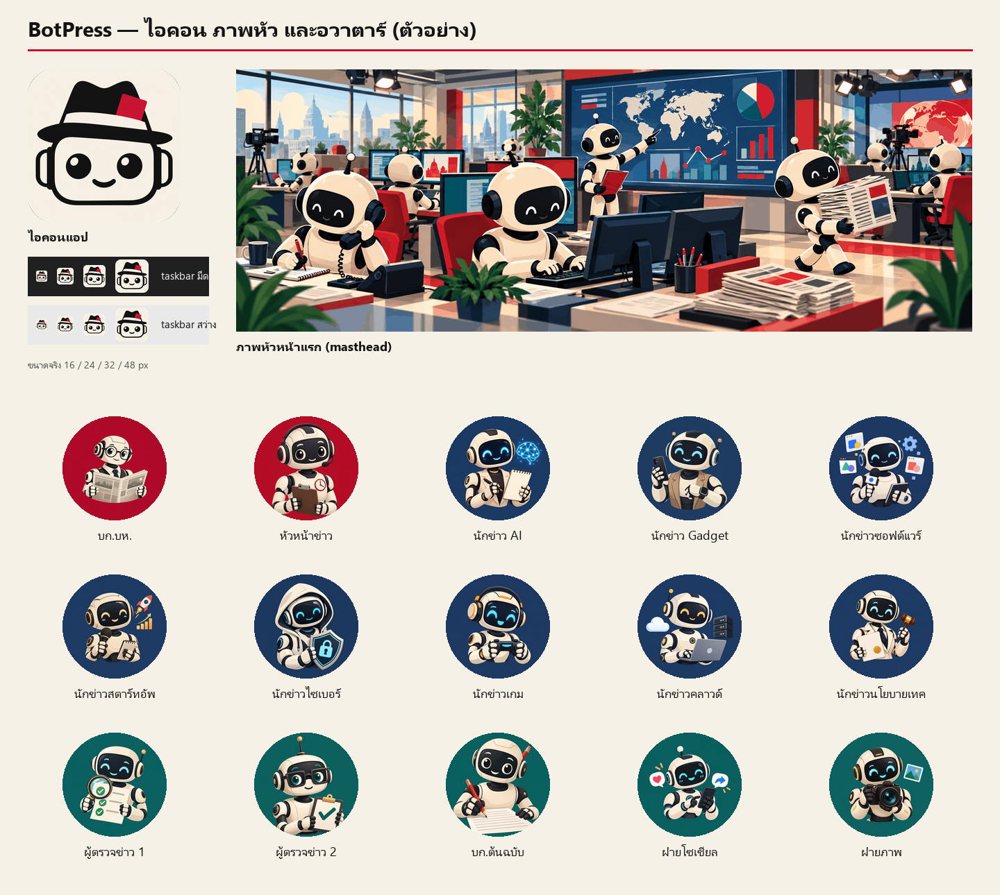

# CHAYLUEKLAB AI COMMAND CENTER

ระบบผู้ช่วย AI หลายตัวสำหรับ CHAYLUEKLAB
ใช้เป็นศูนย์ควบคุมงานเว็บไซต์ คอนเทนต์ LINE OA
Affiliate ระบบอัตโนมัติ การตรวจงาน และรายงานสถานะ



> เอกสารนี้เขียนไว้ให้นักพัฒนาหรือ AI ตัวถัดไปรับงานต่อได้โดยไม่ต้องถามใคร ข้อมูลทุกข้อตรวจกับโค้ดใน repo นี้แล้ว (อ้างอิงเป็น `ไฟล์:บรรทัด`) ข้อที่ยังไม่ได้ตรวจจะเขียนกำกับว่า **(ยังไม่ได้ตรวจ)** ไว้
>
> เลขบรรทัดอ้างอิงโค้ด ณ commit แรกที่ขึ้น GitHub ถ้าโค้ดถูกแก้ภายหลังแล้วเลขคลาด ให้ค้นด้วยชื่อ symbol ที่เขียนไว้ข้าง ๆ แทน (เช่น `NEXT`, `BEATS`, `ROUTINES`) ศัพท์ที่ไม่คุ้น เช่น hop, slot, routine, revive ดูได้ที่หัวข้อ 16

## สารบัญ

1. [BotPress คืออะไร](#1-botpress-คืออะไร)
2. [ภาพรวมสถาปัตยกรรม](#2-ภาพรวมสถาปัตยกรรม)
3. [ทีมบอท 15 ตัว](#3-ทีมบอท-15-ตัว)
4. [ขั้นตอนข่าว](#4-ขั้นตอนข่าว)
5. [ตารางงานประจำวัน](#5-ตารางงานประจำวัน)
6. [สิ่งที่ต้องมีก่อน](#6-สิ่งที่ต้องมีก่อน)
7. [ติดตั้งและรันครั้งแรก](#7-ติดตั้งและรันครั้งแรก)
8. [การใช้งานประจำวัน](#8-การใช้งานประจำวัน)
9. [โครงสร้างไฟล์](#9-โครงสร้างไฟล์)
10. [การตั้งค่า](#10-การตั้งค่า)
11. [การทดสอบ](#11-การทดสอบ)
12. [แก้ไขและต่อยอด](#12-แก้ไขและต่อยอด)
13. [ปัญหาที่พบบ่อยและวิธีแก้](#13-ปัญหาที่พบบ่อยและวิธีแก้)
14. [ข้อจำกัดและงานที่ยังค้าง](#14-ข้อจำกัดและงานที่ยังค้าง)
15. [กฎที่ต้องรักษา](#15-กฎที่ต้องรักษา)
16. [อภิธานศัพท์](#16-อภิธานศัพท์)

---

## 1. BotPress คืออะไร

**เป้าหมาย:** ให้บอท AI 15 ตัวทำงานเหมือนกองบรรณาธิการข่าวจริง ตั้งแต่หาข่าว เสนอข่าว มอบหมายงาน เขียน ตรวจข้อเท็จจริง เกลาภาษา จนถึงเตรียมข้อความโซเชียลและบรีฟภาพ เมื่อบรรณาธิการบริหาร (บอท `บก.บห.`) จะเผยแพร่ ระบบจะหยุดรอลุงจืดกดอนุมัติทุกครั้ง ข่าวที่ผ่านแล้วจะถูกเขียนเป็นไฟล์ Markdown ที่ `D:\botpress\news\<YYYY-MM-DD>\<id>.md`

**ทำไมต้องทำ:** ลุงจืดต้องการสำนักข่าวที่บอททำงานเองตามตารางทุกวัน ส่วนคนทำแค่อนุมัติก่อนเผยแพร่ บอทใช้ LLM บนเครื่องนี้ (Gemma 4 บน llama-server) เป็นค่าเริ่มต้น

**สิ่งที่ BotPress ไม่ใช่:**
- **ไม่มีเว็บไซต์หรือหน้าเว็บสาธารณะ** ตามที่เจ้าของตัดสินใจ HTML/JS ในโฟลเดอร์ `ui/` เป็นแค่ UI ของแอปเองที่แสดงใน WebView2 ส่วน `https://botpress.example/` เป็น virtual host ที่ WebView2 map ไปที่โฟลเดอร์ `ui` บนดิสก์ ไม่ใช่เว็บจริง (`MainWindow.xaml.cs:62-64`)
- บอทไม่โพสต์โซเชียลจริงและไม่สร้างภาพ ฝ่ายโซเชียลเขียนแค่ข้อความร่าง ส่วนฝ่ายภาพเขียนแค่บรีฟภาพ

**ที่มา:** โคลนแล้วออกแบบใหม่จาก BotTeam (`D:\localai\botadmin`, แอป `BotAdmin.exe`) ทั้งสองแอปใช้โครงสร้างพื้นฐานชุดเดียวกัน (ดูหัวข้อ 2) แต่ BotPress ใช้บัญชี Rakazo ของตัวเองคือ `owner@botpress.local` (`RakazoClient.cs:17`) ส่วน BotTeam ใช้ `owner@botteam.local` บอทของสองแอปจึงไม่ปนกัน

---

## 2. ภาพรวมสถาปัตยกรรม

```
Windows ─────────────────────────────────────────────────────────────────────────────────────────────
                                                                                                    
  dist\BotPress.exe  (WPF + WebView2, .NET 10)                                                      
  ├─ WebView2  https://botpress.example/index.html  →  ไฟล์ใน <exe>\ui  (หรือ %BOTPRESS_UI_DIR%)   
  │    ui/*.js เรียก host ผ่าน App.call(op,args) → Dispatch (MainWindow.xaml.cs:182-223)             
  ├─ RakazoClient.cs  ── POST http://127.0.0.1:5173/rpc/<path>  (allow-list, ล็อกอินบัญชีเจ้าของเอง) 
  ├─ Monitor.cs       ── GPU/CPU/RAM, wsl -l -v, llama-server :8080, Rakazo :3110/health, watchdog  
  ├─ Newsdesk.cs      ── อ่าน D:\botpress\news\stories.json ตรง ๆ (บอร์ดข่าวอ่านอย่างเดียว)          
  └─ Speech.cs        ── python stt.py medium (faster-whisper, CPU)  สำหรับปุ่มไมค์                  
                                                                                                    
  D:\localai\serve-th.bat → llama-server.exe :8080  (Gemma 4, 2 slots)        [ไม่อยู่ใน repo นี้]  
  D:\bcproxy  BCAiRouter :3399  (ทางเลือก)                                     [ไม่อยู่ใน repo นี้]  
                                                                                                    
WSL Ubuntu-24.04 ────────────────────────────────────────────────────────────────────────────────────
                                                                                                    
  bash /mnt/d/botpress/botpress.sh  →  bash /mnt/d/localai/botadmin/rakazo.sh  (ใช้ร่วมกับ BotTeam) 
  ~/rakazo  docker compose  Rakazo v0.1.6                                      [ไม่อยู่ใน repo นี้]  
  ├─ web :5173 · api :3110 · rakazo-worker-1 · rakazo-postgres-1 · supervisor                       
  ├─ คอมพิวเตอร์ของบอท (container ละตัว, computerMode "dedicated")                                  
  └─ botpress-newsdesk  (node /app/server.mjs, อยู่ใน network namespace ของ rakazo-worker-1)       
        บอทเรียก MCP ที่ http://localhost:7790/mcp  (Bearer token จาก news/.token)                  
        mount: /mnt/d/botpress/newsdesk → /app (ro) · /mnt/d/botpress/news → /news                 
                                                                                                    
  socat บน docker0:  172.17.0.1:18080 → llama-server :8080   (llama-bridge.service)                 
                     172.17.0.1:18399 → BCAiRouter   :3399   (bcai-bridge.service)                  
```

ลำดับการเรียกตอนบอททำงาน: Rakazo worker รันบอท → เรียก LLM ผ่าน socat bridge (โหมด Local) → บอทเรียกเครื่องมือ `mcp__newsdesk__*` → `newsdesk/server.mjs` เขียน `news/stories.json` → แอปอ่านไฟล์นี้มาแสดงบนบอร์ดทุก 5 วินาที

### อะไรอยู่ใน repo นี้ และอะไรอยู่นอก repo

| อยู่ใน `D:\botpress` (repo นี้) | อยู่นอก repo (ใช้ร่วมกับ BotTeam ห้ามแก้จาก repo นี้) |
|---|---|
| แอป host (`*.cs`, `*.xaml`, `BotPress.csproj`) | `D:\localai\serve-th.bat`, `D:\localai\llamacpp\bin\llama-server.exe`, โมเดล Gemma |
| UI ของแอป (`ui/`) | `D:\localai\botadmin\rakazo.sh` (`botpress.sh:33` เรียกต่อ) |
| `botpress.sh` (ห่อ `rakazo.sh` และเพิ่ม container ของโต๊ะข่าว) | `D:\localai\botadmin\tests\cdp.mjs` (`tools/botteam-pause.mjs:8` import) |
| โต๊ะข่าว MCP (`newsdesk/server.mjs`) | Rakazo ทั้งชุดใน WSL (`~/rakazo`, `.env`, `docker-compose.override.yml`, hotfix) |
| สคริปต์สร้างทีม (`seed-bots.mjs`), เทสต์ (`tests/`), เครื่องมือ (`tools/`) | systemd `llama-bridge.service`, `bcai-bridge.service` ใน WSL (ดู `D:\localai\RUNBOOK.md`) |
| ภาพต้นฉบับและไอคอน (`assets/`) | ไฟล์คีย์ใน `D:\localai\*.txt` และ BCAiRouter ที่ `D:\bcproxy` |

ของในคอลัมน์ขวาทั้งหมด รวมทั้ง `D:\localai\RUNBOOK.md` **ไม่อยู่ใน GitHub repo นี้** ถ้าเป็นเครื่องใหม่ให้อ่านหัวข้อ 6 "เครื่องใหม่ที่ยังไม่มี `D:\localai`" ก่อน

**เครื่องนี้รันได้ทีละแอป:** BotPress กับ BotTeam ใช้ llama-server ตัวเดียวกันซึ่งมีแค่ 2 slot และใช้ Rakazo ชุดเดียวกัน BotPress จะไม่ยอมเปิดถ้ามี process ชื่อ `BotAdmin` ทำงานอยู่ (`Program.cs:18-22`) ก่อนใช้ BotPress ให้พัก BotTeam ด้วย `tools/botteam-pause.mjs` (ดูหัวข้อ 7)

---

## 3. ทีมบอท 15 ตัว

ทีมสร้างจาก `seed-bots.mjs` (`BOTS` อยู่ที่ :36-85) บอทแต่ละตัวมีคอมพิวเตอร์ของตัวเอง (`computerMode: "dedicated"`) ชื่อบอทต้องตรงตัวอักษรทุกตัว เพราะ UI ใช้ชื่อเลือกอวาตาร์ (`ui/app.js:73-76`) และเทสต์ใช้ชื่อหาบอท

| ชื่อบอท | ฝ่าย | หน้าที่ | สาย / ผู้ตรวจ | อวาตาร์ |
|---|---|---|---|---|
| `บก.บห.` | กองบรรณาธิการ | บรรณาธิการบริหาร ด่านสุดท้าย และเป็นตัวเดียวที่เรียก `publish_story` ได้ ตรวจเรื่อง `ready` ถ้าผ่านให้เผยแพร่ ถ้าต้องแก้ส่งกลับ `editing` ถ้าไม่ใช้ให้ `killed` | ทุกสาย | `editor-in-chief` |
| `หัวหน้าข่าว` | กองบรรณาธิการ | ประชุมข่าว คัดเรื่อง `pitched` เองแล้วมอบหมาย (`assigned` + reporter) หรือตัดทิ้ง (`killed`) และตามงานที่ค้างเกิน 3 ชั่วโมง ห้ามเรียก `publish_story` เรื่องสาย `other` ให้นักข่าวสายที่ใกล้ที่สุด | ทุกสาย | `news-editor` |
| `นักข่าว AI` | ฝ่ายข่าว | หาข่าว เสนอข่าว เขียนข่าว | `ai` → ผู้ตรวจข่าว 1 | `reporter-ai` |
| `นักข่าว Gadget` | ฝ่ายข่าว | เหมือนข้างบน สเปกและราคาต้องมาจากผู้ผลิตหรือผู้จำหน่ายในไทย ข่าวหลุดต้องเขียนว่า "ข่าวลือ" | `gadget` → ผู้ตรวจข่าว 1 | `reporter-gadget` |
| `นักข่าวซอฟต์แวร์` | ฝ่ายข่าว | เหมือนข้างบน | `software` → ผู้ตรวจข่าว 1 | `reporter-software` |
| `นักข่าวสตาร์ทอัพ` | ฝ่ายข่าว | เหมือนข้างบน ตัวเลขต้องมาจากประกาศทางการหรือเอกสารที่ยื่นต่อหน่วยงาน | `startup` → ผู้ตรวจข่าว 1 | `reporter-startup` |
| `นักข่าวไซเบอร์` | ฝ่ายข่าว | เหมือนข้างบน ห้ามเขียนขั้นตอนโจมตีหรือโค้ดเจาะระบบ | `security` → ผู้ตรวจข่าว 2 | `reporter-security` |
| `นักข่าวเกม` | ฝ่ายข่าว | เหมือนข้างบน | `gaming` → ผู้ตรวจข่าว 2 | `reporter-gaming` |
| `นักข่าวคลาวด์` | ฝ่ายข่าว | เหมือนข้างบน | `cloud` → ผู้ตรวจข่าว 2 | `reporter-cloud` |
| `นักข่าวนโยบายเทค` | ฝ่ายข่าว | เหมือนข้างบน ต้องบอกว่าเป็นร่าง ประกาศแล้ว หรือมีผลแล้ว พร้อมวันที่และลิงก์เอกสารทางการ | `policy` → ผู้ตรวจข่าว 2 | `reporter-policy` |
| `ผู้ตรวจข่าว 1` | ฝ่ายตรวจและผลิต | เปิดทุกลิงก์ใน sources แล้วเทียบทีละข้อ ถ้าผ่านให้ `editing` พร้อมเขียน `factcheck` ถ้าไม่ผ่านให้ `drafting` พร้อม note ห้ามแก้เนื้อข่าวเอง | `ai gadget software startup other` | `checker-1` |
| `ผู้ตรวจข่าว 2` | ฝ่ายตรวจและผลิต | เหมือนผู้ตรวจข่าว 1 | `security gaming cloud policy` | `checker-2` |
| `บก.ต้นฉบับ` | ฝ่ายตรวจและผลิต | เกลาภาษาและพาดหัว (≤ 90 ตัวอักษร) ขอบรีฟภาพและข้อความโซเชียล เมื่อได้ครบทั้งสองอย่างจึงย้ายเรื่องเป็น `ready` แล้วแจ้ง `บก.บห.` ห้ามเขียนช่อง image และ social เอง | ทุกสาย | `copy-editor` |
| `ฝ่ายโซเชียล` | ฝ่ายตรวจและผลิต | เขียนช่อง `social` 2 แบบ คือ "สั้น:" ไม่เกิน 280 ตัวอักษร และ "ยาว:" 3-5 บรรทัด แต่ไม่โพสต์ที่ไหน | ทุกสาย | `social` |
| `ฝ่ายภาพ` | ฝ่ายตรวจและผลิต | เขียนช่อง `image` เป็นบรีฟ 4 บรรทัด คือ ภาพหลัก คำบรรยายภาพ alt text และที่มาภาพ แต่ไม่สร้างภาพ | ทุกสาย | `photo` |

- สายข่าว (beat) มีทั้งหมด 9 สาย คือ `ai`, `gadget`, `software`, `startup`, `security`, `gaming`, `cloud`, `policy` และ `other` สาย `other` ไม่มีนักข่าวประจำ (`newsdesk/server.mjs:19-22`, `seed-bots.mjs:13-15`)
- Prompt ของบอทแต่ละตัวประกอบด้วย `role + TEAM + NEWSROOM(name) + COMMON` (`seed-bots.mjs:139`)
  - `TEAM` คือรายชื่อทีมและห้อง
  - `NEWSROOM` คือวิธีใช้โต๊ะข่าวและกติกาข่าว เช่น ต้องมีลิงก์แหล่งที่มา ต้องมีแหล่งทางการ 1 แหล่งหรือแหล่งอิสระ 2 แหล่ง ไม่อย่างนั้นต้องเขียนว่า "ยังไม่ยืนยัน" และยกคำพูดได้ไม่เกิน 1 ประโยค
  - `COMMON` คือกติกากลาง เช่น ห้ามซื้อ สมัคร โพสต์ หรือส่งอีเมลโดยไม่ได้รับอนุมัติ และห้ามขอรหัสผ่าน
  - Prompt ที่ได้ยาวประมาณ 7,900-8,700 ตัวอักษรต่อบอท ขณะที่ Rakazo รับได้สูงสุด 20,000 ตัวอักษร

### สิทธิ์ใช้เครื่องมือโต๊ะข่าว

- บอททุกตัวถูกผูกกับ MCP server slug `newsdesk` ชื่อ "โต๊ะข่าว" (`seed-bots.mjs:232-250`)
- บอท 14 ตัวได้แค่ `pitch_story`, `list_stories`, `get_story`, `update_story` (`DESK_TOOLS`, :145)
- **มีแค่ `บก.บห.` ที่เห็น `publish_story`**

### ห้องประชุม 3 ห้อง (`seed-bots.mjs:86-90`)

Rakazo จำกัดห้องละ 2-6 บอท ทุกห้องตอนนี้มีสมาชิกเต็ม 6 แล้ว

| ห้อง | สมาชิก |
|---|---|
| `ห้องข่าว 1` | บก.บห., หัวหน้าข่าว, นักข่าว AI, นักข่าว Gadget, นักข่าวซอฟต์แวร์, นักข่าวสตาร์ทอัพ |
| `ห้องข่าว 2` | บก.บห., หัวหน้าข่าว, นักข่าวไซเบอร์, นักข่าวเกม, นักข่าวคลาวด์, นักข่าวนโยบายเทค |
| `ห้องตรวจ-ผลิต` | หัวหน้าข่าว, ผู้ตรวจข่าว 1, ผู้ตรวจข่าว 2, บก.ต้นฉบับ, ฝ่ายโซเชียล, ฝ่ายภาพ |

---

## 4. ขั้นตอนข่าว

ทุกเรื่องข่าวอยู่ในโต๊ะข่าว (`newsdesk/server.mjs`) ซึ่งเป็น MCP server ที่บังคับลำดับสถานะเอง บอทข้ามขั้นไม่ได้ (`NEXT` อยู่ที่ :30-34 และ `NEEDS` อยู่ที่ :37-43)

```
 นักข่าว: pitch_story (title, beat, angle, sources)
   │
   ▼
 pitched ──หัวหน้าข่าว (+reporter)──▶ assigned ──นักข่าว──▶ drafting ◀─────────────────────────────┐
                                                          │ นักข่าว: ต้องมี headline + body + sources ≥ 1  │
                                                          ▼                                         │
                                                      factcheck ── ไม่ผ่าน: ส่งกลับ (ผู้ตรวจ) ───────┤
                                                          │ ผู้ตรวจข่าว 1/2: ต้องมี factcheck          │
                                                          ▼                                         │
                                ┌──────────────────▶  editing  ── ปัญหาใหญ่: ส่งกลับ (บก.ต้นฉบับ) ───┘
                                │                         │ บก.ต้นฉบับ: ต้องมี headline + body + social + image
                                │                         ▼
                                └── ส่งกลับ + note ──  ready      (ล็อกเนื้อหา: แก้ได้แค่ status + note)
                                     (บก.บห.)             │ บก.บห.: publish_story (title = headline ตรงตัว)
                                                          │        → Rakazo หยุดรอลุงจืดกดอนุมัติ
                                                          ▼
                                                      published ──▶ news/<YYYY-MM-DD>/<id>.md

 ทุกสถานะที่ยังไม่จบ ── update_story status="killed" + note (บังคับ) ──▶ killed
```

| ย้ายไป | ใครทำ | เงื่อนไขที่ server ตรวจ (ต้องมีหลังรวมค่าที่ส่งมาในครั้งเดียวกัน) |
|---|---|---|
| `pitched` | นักข่าว (`pitch_story`) | `by`, `title`, `beat`, `angle` |
| `assigned` | หัวหน้าข่าว | `reporter` |
| `drafting` | นักข่าว | (ไม่มี) |
| `factcheck` | นักข่าว แล้ว `message_bot` ถึงผู้ตรวจตามสาย | `headline`, `body`, sources อย่างน้อย 1 รายการ |
| `editing` | ผู้ตรวจข่าว 1 หรือ 2 | `factcheck` ไม่ว่าง |
| `ready` | บก.ต้นฉบับ | `headline`, `body`, `social`, `image` |
| `published` | บก.บห. (`publish_story` เท่านั้น) และลุงจืดอนุมัติ | สถานะต้องเป็น `ready`, `title` ต้องตรงกับ headline และต้องยังไม่มีไฟล์ปลายทาง |
| `killed` | ใครก็ได้ตามหน้าที่ | ต้องมี `note` |

### กติกาสำคัญของ server

- **การส่งกลับ** ทำได้ 3 ทาง คือ `factcheck → drafting`, `editing → drafting` และ `ready → editing` ทางสุดท้ายต้องมี `note` ส่วนการย้ายแบบอื่น เช่น `ready → drafting` จะถูกปฏิเสธ
- **ล้างผลตรวจทุกครั้งที่เข้า `factcheck`** (:221-232)
  - ผลตรวจเดิมจะถูกย้ายไปเก็บใน history note
  - ส่ง `factcheck` มาพร้อมกับการย้ายเข้า `factcheck` ไม่ได้ ต้องย้ายสถานะก่อนแล้วค่อยบันทึกผลตรวจในครั้งถัดไป
- **ล็อกเนื้อหาใน `ready`** (:212)
  - แก้ reporter, headline, body, sources, factcheck, social หรือ image ไม่ได้
  - สิ่งที่ลุงจืดอนุมัติจึงตรงกับข้อความที่จะเผยแพร่ทุกตัวอักษร
- **`published` และ `killed` เป็นสถานะสุดท้าย** แก้อะไรต่อไม่ได้แล้ว
- `title`, `beat`, `angle` ตั้งได้ตอน pitch เท่านั้น เปลี่ยนภายหลังไม่ได้
- รหัสเรื่องมีรูปแบบ `YYYYMMDD-NN` ใช้วันที่ตามเวลากรุงเทพ ลำดับ NN เริ่มนับใหม่ทุกเที่ยงคืน ส่วน `createdAt`, `updatedAt` และ `history[].at` เป็น UTC
- server ไม่ตรวจว่าใครเป็นใคร เพราะ `by` เป็นข้อความอิสระ การจำกัดคนเผยแพร่ทำผ่านสิทธิ์ MCP และการอนุมัติของ Rakazo

### การเผยแพร่และการอนุมัติของเจ้าของ

การเผยแพร่มีด่านป้องกันหลายชั้น

1. **สิทธิ์เครื่องมือ:** มีแค่ `บก.บห.` ที่เห็น `publish_story`
2. **Approval rule:** `seed-bots.mjs` ตั้ง `require_approval` ให้ `mcp__newsdesk__publish_story` ทำให้ Rakazo หยุดรอ และการ์ด "ขออนุมัติ" จะขึ้นในแชทและในศูนย์งานแท็บ "รอคุณ"
   - ปุ่ม **"อนุญาตเสมอ" ถูกซ่อนสำหรับ `publish_story`** และ handler ก็กันซ้ำอีกชั้น (`ui/chat.js:157-160, 241, 407`, `ui/work.js:65, 79`) เพราะการกด "เสมอ" จะปิดการอนุมัติให้บอททุกตัวในบัญชี
   - ถ้ารัน `seed-bots.mjs` ซ้ำ กฎ "อนุญาตเสมอ" ที่เคยกดไว้ของ 6 รายการที่ต้องอนุมัติจะถูกลบทิ้ง
3. **Prompt:** บอทถูกสั่งไม่ให้ขอให้บอทอื่นอนุมัติแทน
4. **Server:** `title` ต้องตรงกับ headline และเนื้อหาถูกล็อกตั้งแต่ `ready`

ถ้า `บก.บห.` ขอเผยแพร่เรื่องเดิมซ้ำ อาจเห็นการ์ดอนุมัติ 2 ใบ ให้อนุมัติใบแรก แล้วกด "ปฏิเสธ" ที่ใบที่สอง ถ้าไปกดอนุญาตใบที่สอง การเรียกจะไม่สำเร็จและได้ error "เผยแพร่ไปแล้ว" (:248) **ห้ามปล่อยใบที่สองค้างไว้** เพราะการ์ดไม่ปิดเอง และ run ของ `บก.บห.` ที่ขอใบนั้นจะหยุดรอจนกว่าจะมีคนตอบ

### ไฟล์ข่าวที่ได้

`publish_story` เขียนไฟล์ `$NEWS_DIR/<YYYY-MM-DD>/<id>.md` โดยใช้วันที่ตอนเผยแพร่ (เวลากรุงเทพ) ในเครื่องนี้คือ `D:\botpress\news\...` ขั้นตอนคือเขียนไฟล์ `.md` แบบ atomic ก่อน แล้วจึงบันทึก `stories.json` ถ้าบันทึก state ไม่สำเร็จ ไฟล์ `.md` จะถูกลบออก (`server.mjs:246-265`) รูปแบบไฟล์ (`render`, :130-136):

```markdown
# <headline>
> สาย: <ชื่อสาย> · นักข่าว: <reporter> · เผยแพร่: <YYYY-MM-DD HH:MM> น.

<body>

## ภาพประกอบ (บรีฟ)
## แหล่งอ้างอิง
- [title](url)
## ข้อความโซเชียล
## ผลตรวจข้อเท็จจริง
```

หัวข้อที่ไม่มีข้อมูลจะไม่ถูกเขียนลงไฟล์

### บทเรียนจากการรันจริงครั้งแรกบน Gemma 4 (2026-10-04)

- Gemma มักข้ามขั้นตอนแบบ "ส่ง X ให้บอทอื่นแล้วรอคำตอบ" แล้วเขียนรายการนั้นเป็นคำตอบของตัวเองแทน จึงแก้ให้ `หัวหน้าข่าว` คัดและมอบหมายเรื่อง pitched เองคนเดียว ส่วน `บก.บห.` คุมแค่ด่าน `ready → published`
- ผู้ตรวจข่าวส่งเรื่องกลับจริง ครั้งนั้นจับคำพิมพ์ผิดในพาดหัวได้
- Gemma อาจเขียนข่าวจากแหล่งที่ไม่น่าเชื่อถือ **ด่านอนุมัติของคนก่อนเผยแพร่จึงเป็นตัวป้องกันจริง** ควรเปิดอ่านเรื่องบนบอร์ดก่อนกดอนุมัติทุกครั้ง

---

## 5. ตารางงานประจำวัน

Routine ทั้งหมดสร้างโดย `seed-bots.mjs` (`ROUTINES` อยู่ที่ :149-170) ตั้งเป็น `timezone: "Asia/Bangkok"`, `active: true`, `notify: true` รวม 8 routine และรัน 14 ครั้งต่อวัน เวลาถูกวางให้เหลื่อมกันเพราะ llama-server มีแค่ 2 slot

| เวลา | บอท | ชื่อ routine | ทำอะไร |
|---|---|---|---|
| 07:00 | หัวหน้าข่าว | ประชุมข่าวเช้า | เรียก `list_stories` แล้วส่งใบงานถึงนักข่าวทั้ง 8 สายทีละคน ให้หาข่าวสายละ 1-2 เรื่องแล้ว `pitch_story` |
| 09:00 | หัวหน้าข่าว | รวบรวมข่าวเช้า | อ่านเรื่อง `pitched` แล้วตัดสินทีละเรื่อง (`assigned` หรือ `killed`) จากนั้นสรุปถึงลุงจืด |
| 10:30, 14:30, 18:30 | ผู้ตรวจข่าว 1 | กวาดงานตรวจ (ผู้ตรวจข่าว 1) | ตรวจเรื่อง `factcheck` ของสาย ai gadget software startup other |
| 10:45, 14:45, 18:45 | ผู้ตรวจข่าว 2 | กวาดงานตรวจ (ผู้ตรวจข่าว 2) | ตรวจเรื่อง `factcheck` ของสาย security gaming cloud policy |
| 11:30, 15:30, 19:30 | บก.ต้นฉบับ | กวาดงานเกลา | ทำเรื่อง `editing` ทีละเรื่อง ดูว่ามี image และ social แล้วหรือยัง |
| 12:00 | บก.บห. | ตรวจข่าวรอเผยแพร่ | ตรวจเรื่อง `ready` ถ้าผ่านให้ `publish_story` ถ้าไม่ผ่านส่งกลับ `editing` |
| 13:00 | หัวหน้าข่าว | รอบข่าวบ่าย | คัดเรื่อง pitched ที่ค้าง ตามงานที่ค้างเกิน 3 ชั่วโมง และสรุปจำนวนเรื่องในแต่ละสถานะ |
| 17:30 | บก.บห. | สรุปข่าวเย็น | ตรวจ `ready` แล้ว `publish_story` จากนั้นสรุปทั้งวันไม่เกิน 10 บรรทัด |

นักข่าวไม่มี routine ของตัวเอง แต่จะเริ่มทำงานเมื่อ `หัวหน้าข่าว` ส่งข้อความหา

### ทำไมระบบเป็นแบบ "ดึงงาน" (pull) แทน "ส่งต่อ" (push)

ข้อจำกัดของ Rakazo ที่ทำให้ต้องออกแบบแบบนี้ (`seed-bots.mjs:146-148`)

- สายที่บอทส่งงานต่อกันด้วย `message_bot` หยุดเมื่อครบ 6 hop
- เรียก `schedule_create` ใน routine ไม่ได้
- ห้องหนึ่งมีได้ 2-6 บอท
- Instructions ยาวได้ไม่เกิน 20,000 ตัวอักษร
- Approval rule มีผลทั้งบัญชี

ผลคือเจ้าของแต่ละขั้นจะกวาดสถานะของตัวเองจากโต๊ะข่าวตามเวลา routine แต่ละรอบเริ่มที่ hop 0 ใหม่ งานจึงไม่ติดอยู่กลางสายข้อความยาว ๆ

### Routine แบบ quick-start ในแอป

แท็บ "งานประจำ" มีเทมเพลตสำเร็จรูป (`ui/work.js:143-149`) เช่น "ส่องข่าวสาย <beat>" ของนักข่าว 8 สาย เวลา 08:00-09:10 ห่างกันรอบละ 10 นาที เทมเพลตเหล่านี้ **ไม่ได้ถูก seed** และจะขึ้นเฉพาะเมื่อบอทนั้นยังไม่มี routine ชื่อเดียวกัน

---

## 6. สิ่งที่ต้องมีก่อน

### ซอฟต์แวร์บนเครื่อง

| ต้องมี | ใช้ทำอะไร | หมายเหตุ |
|---|---|---|
| Windows 11 + WSL2 distro `Ubuntu-24.04` | Rakazo และ docker | ต้องตั้งค่าตามหัวข้อย่อย "ตั้งค่า WSL" ด้านล่าง (user `rakazo` เป็น default, systemd, mirrored networking) |
| docker ใน WSL พร้อม image `ghcr.io/elie222/rakazo/app:v0.1.6` | Rakazo และ container `botpress-newsdesk` | newsdesk รันด้วย `--pull never` (`botpress.sh:10, 21`) image จึงต้องอยู่ในเครื่องแล้ว |
| Rakazo v0.1.6 ที่ `~/rakazo` ใน WSL | แพลตฟอร์มบอท (web :5173, api :3110) | ดูแลฝั่ง BotTeam (`D:\localai\RUNBOOK.md` ไม่มีขั้นติดตั้งจากศูนย์ เครื่องใหม่ดูหัวข้อย่อย "เครื่องใหม่ที่ยังไม่มี `D:\localai`" ด้านล่าง) |
| llama-server + Gemma 4 | LLM ของโหมด Local (:8080, ชื่อโมเดล `gemma4`) | เปิดด้วย `D:\localai\serve-th.bat` (`-np 2` คือ 2 slot) |
| socat bridge 2 ตัวใน WSL | ให้ container เรียก LLM และ BCAiRouter บน Windows ได้ | `llama-bridge.service` (172.17.0.1:18080 → :8080) และ `bcai-bridge.service` (172.17.0.1:18399 → :3399) ตาม `D:\localai\RUNBOOK.md` |
| NVIDIA GPU + `nvidia-smi` | LLM, Monitor และ `--selftest` | ถ้าไม่มี GPU, `--selftest` จะ FAIL เพราะตรวจ `VramTotal>0` เครื่องที่ใช้ทดสอบคือ RTX 5060 Ti 16 GB ซึ่ง Gemma 4 ใช้ VRAM ราว 15.5/16 GB (`D:\localai\RUNBOOK.md` §9) |
| Git for Windows | Git Bash, `curl` และ clone repo | คำสั่งตัวอย่างในหัวข้อ 7 เขียนสำหรับ Git Bash |
| .NET 10 SDK | build (`net10.0-windows`, WPF) | เครื่องใหม่ติดตั้งจาก dotnet.microsoft.com แล้วตรวจด้วย `dotnet --list-sdks` ว่าขึ้น 10.x **เครื่องนี้ต่างออกไป:** `dotnet` ที่อยู่ใน PATH (`C:\Program Files\dotnet`) ไม่มี SDK เลย (`dotnet --list-sdks` ว่าง ถ้าเรียก `dotnet publish` จะได้ "No .NET SDKs were found") ต้องเรียก `%LOCALAPPDATA%\Microsoft\dotnet\dotnet.exe` (SDK 10.0.401) ทุกครั้ง |
| WebView2 Runtime | แสดง UI | ใช้ package `Microsoft.Web.WebView2` 1.0.4258.31 (ยังไม่ได้ตรวจว่าเครื่องปลายทางมี runtime หรือไม่) |
| Node.js 22 ขึ้นไป (nodejs.org) | `seed-bots.mjs`, `tests/*.mjs`, `tools/botteam-pause.mjs`, selftest ของ newsdesk | ใช้ WebSocket ที่มากับ Node และไม่ต้องติดตั้ง package (`tests/cdp.mjs`) Node 22.0.0 เป็นรุ่นแรกที่เปิด WebSocket โดยไม่ต้องใส่ flag (ตาม changelog ของ Node) เครื่องนี้ใช้ v24 |
| Python + `faster_whisper` + โมเดล `medium` ใน HF cache | ปุ่มไมค์ (พูดเป็นข้อความ) | ไม่บังคับ `stt.py` ตั้ง `HF_HUB_OFFLINE=1` จึงไม่ดาวน์โหลดโมเดลเอง ต้องติดตั้งและโหลดโมเดลล่วงหน้าตอนต่อเน็ต (คำสั่งอยู่ใต้ตาราง) `Speech.cs:48` เรียกคำสั่ง `python` ตรง ๆ จึงต้องเป็น Python ตัวจริงใน PATH ไม่ใช่ alias ของ Microsoft Store |
| Python + Pillow | `tools/make-assets.py` | ไม่บังคับ ใช้เฉพาะตอนสร้างภาพใหม่ |
| BCAiRouter (`D:\bcproxy`, :3399) | โหมด 🔀 BCAiRouter | ไม่บังคับ ถ้าไม่ได้เปิดห้ามเลือกโหมดนี้ |

ติดตั้งปุ่มไมค์ (ทำครั้งเดียวตอนต่อเน็ต):

```bash
pip install faster-whisper
python -c "from faster_whisper import WhisperModel; WhisperModel('medium', device='cpu', compute_type='int8')"   # โหลดโมเดลลง HF cache
```

### ตั้งค่า WSL (ทำครั้งเดียวตอนตั้งเครื่อง)

แอปเรียก `wsl.exe -d Ubuntu-24.04 --exec bash ...` โดยไม่ระบุ user (`Monitor.cs:135`) ส่วน `tools/botteam-pause.mjs` ใช้ `-u rakazo` และ `rakazo.sh` เริ่มด้วย `cd ~/rakazo` ดังนั้น user ต้องชื่อ `rakazo` ตรงตัวและเป็น default user ค่าที่เครื่องนี้ใช้อยู่จริงมีดังนี้

- `/etc/wsl.conf` ใน distro (ต้องเปิด systemd เพราะ `llama-bridge` และ `bcai-bridge` เป็น systemd service):
  ```ini
  [boot]
  systemd=true

  [user]
  default=rakazo
  ```
- `%UserProfile%\.wslconfig` บน Windows ต้องมี `networkingMode=mirrored` ใต้ `[wsl2]` เพราะ socat ใน WSL ยิงไปที่ `127.0.0.1:8080` ของ Windows (เครื่องนี้ตั้ง `vmIdleTimeout=-1` ไว้ด้วย)
- user `rakazo` ต้องอยู่ใน group `docker`
- แก้แล้วให้ `wsl --shutdown` แล้วเปิดใหม่ จากนั้นตรวจด้วย `wsl -d Ubuntu-24.04 -- sh -c 'whoami; id -nG'` ต้องได้ `rakazo` และมี `docker` อยู่ในรายการ group

### เครื่องใหม่ที่ยังไม่มี `D:\localai`

**BotPress รันเดี่ยวไม่ได้** มันพึ่ง infra ของ BotTeam ทั้งชั้น ซึ่งไม่อยู่ใน GitHub repo นี้ และ `D:\localai\RUNBOOK.md` ก็ไม่มีขั้นติดตั้งจากศูนย์ (มีแค่ภาพรวม เปิดปิด hotfix อัปเกรด backup แก้ปัญหา และเทสต์) ของที่ต้องมีครบก่อนเริ่มหัวข้อ 7:

| ของที่ต้องมี | ใครใช้ |
|---|---|
| `D:\localai\serve-th.bat` | `Monitor.cs` (`LlmBat`) ใช้เปิด LLM |
| `D:\localai\llamacpp\bin\llama-server.exe` | `serve-th.bat` และ `Monitor.cs:81` ใช้ path นี้ระบุ process |
| `D:\localai\models\gemma-4-26B-A4B-it-UD-IQ4_XS.gguf` และ `mmproj-gemma-4-26B-A4B-it-F16.gguf` | `serve-th.bat` |
| `D:\localai\llm-api-key.txt` (รูปแบบดูตาราง "ไฟล์สำคัญ") | `serve-th.bat`, `Monitor.cs`, `RakazoClient.cs` |
| โฟลเดอร์ `D:\localai\logs\` | `Monitor.cs` (`LlmLog`) เขียน log ของ llama-server |
| `D:\localai\botadmin\rakazo.sh` | `botpress.sh:33` |
| `D:\localai\botadmin\tests\cdp.mjs` | `tools/botteam-pause.mjs:8` (เฉพาะเครื่องที่มี BotTeam) |
| `~/rakazo` ใน WSL: `.env`, `docker-compose.images.yml`, `docker-compose.override.yml`, `hotfix/` | `rakazo.sh` |
| docker image `ghcr.io/elie222/rakazo/app:v0.1.6` และ `botteam/computer:v0.1.6-th` (build เองในเครื่อง ตาม RUNBOOK §4) | Rakazo, newsdesk และคอมพิวเตอร์ของบอท |
| systemd `llama-bridge.service` และ `bcai-bridge.service` ใน WSL | ให้ container เรียก LLM และ BCAiRouter |

มี 2 ทาง

- **(ก) คัดจากเครื่องเดิม (แนะนำ):** คัดโฟลเดอร์ `D:\localai` ทั้งโฟลเดอร์ และย้าย distro ด้วย `wsl --export Ubuntu-24.04 <ไฟล์.tar>` บนเครื่องเดิม แล้ว `wsl --import Ubuntu-24.04 <โฟลเดอร์> <ไฟล์.tar>` บนเครื่องใหม่ จากนั้นตรวจตาม "ตั้งค่า WSL" ด้านบน ไฟล์ tar มีฐานข้อมูลและความลับของ Rakazo อยู่ด้วย ต้องเก็บแบบความลับ
- **(ข) ติดตั้งใหม่:** ติดตั้ง Rakazo v0.1.6 ตามเอกสารของ Rakazo แล้วทำ hotfix ตาม `D:\localai\RUNBOOK.md` §4 ส่วนการติดตั้ง llama.cpp, โมเดล, socat bridge และ image ภาษาไทย **(ยังไม่มีเอกสาร ต้องถามลุงจืด)**

### ค่าใน Rakazo `.env` ที่โค้ดคาดไว้

ตามคอมเมนต์ที่ `RakazoClient.cs:47-48` ต้องตั้งค่าเหล่านี้ใน `~/rakazo/.env` (ชื่อคีย์ตรวจกับ `.env` ของเครื่องนี้แล้ว)

- `RAKAZO_OPENAI_COMPAT_ALLOW_PUBLIC=1`
- `RAKAZO_OPENAI_COMPATIBLE_VISION_MODELS` = รายการ model id คั่นด้วยจุลภาค ต้องมี `gemma4` (โหมด Local) และ `bcai/tools` (โหมด BCAiRouter) เช่น `RAKAZO_OPENAI_COMPATIBLE_VISION_MODELS=gemma4,bcai/tools`
- `RAKAZO_OPENAI_COMPATIBLE_CONTEXT_WINDOWS` = รายการ `<model id>=<จำนวน token>` คั่นด้วยจุลภาค เช่น `hf:zai-org/GLM-5.3-Flash=262144` ในเครื่องนี้ยังไม่ได้ใส่ `gemma4` และ `bcai/tools` ไว้ ค่าที่ Rakazo ใช้เมื่อไม่ระบุ **(ยังไม่ได้ตรวจ)** ถ้าจะใส่ `gemma4` ให้ตรงกับ `-c` ใน `serve-th.bat`
- แก้ `.env` แล้วต้องเริ่ม Rakazo ใหม่ (หยุดแล้วเริ่มจาก Monitor)

### ไฟล์สำคัญ (บอกแค่ path ห้ามเปิดค่ามาแสดงหรือ commit)

| Path | คืออะไร | ใครสร้าง |
|---|---|---|
| `D:\localai\llm-api-key.txt` | คีย์ llama-server (อ่านผ่าน `--api-key-file`) 1 บรรทัดต่อ 1 คีย์ บรรทัดที่ขึ้นต้นด้วย `#` เป็นคอมเมนต์ ต้องมีบรรทัดที่ขึ้นต้นด้วย `gemma-` (admin ใช้กับ `/slots` และ `/metrics`) และ `rakazo-` (ให้ Rakazo เรียก LLM) เจ้าของเครื่องตั้งค่าเองได้ แล้วรีสตาร์ท LLM ถ้าไม่มีบรรทัด `rakazo-` การเรียก Rakazo ครั้งแรกจะล้มด้วย "ไม่พบคีย์ rakazo- ใน llm-api-key.txt" (`RakazoClient.cs:164`) ถ้าไม่มีบรรทัด `gemma-` Monitor จะไม่แสดง slot และ t/s โดยไม่แจ้ง error และ watchdog จะเห็น `/metrics` ล้มตลอดจนรีสตาร์ท llama-server ทุก 3 นาที (`Monitor.cs:32, 68-77, 209-219`) | ฝั่ง BotTeam |
| `D:\localai\bcai-api-key.txt` | คีย์ BCAiRouter ถ้าไม่มีไฟล์จะใช้ค่าสำรอง (`RakazoClient.cs:85`) | ฝั่ง BotTeam |
| `D:\localai\synthetic-api-key.txt` | ใช้เฉพาะโหมด synthetic ซึ่งตอนนี้ไม่มีปุ่มใน UI | ฝั่ง BotTeam |
| `D:\botpress\news\.token` | Bearer token ของโต๊ะข่าว (64 hex) | container newsdesk สร้างเองตอนเริ่มครั้งแรก |
| `%LOCALAPPDATA%\BotPress\owner.json` | อีเมลและรหัสผ่านบัญชี Rakazo `owner@botpress.local` | แอปสร้างเองตอนเรียก Rakazo ครั้งแรก |

**repo ต้องอยู่ที่ `D:\botpress` เท่านั้น** เพราะมี path เขียนตายตัวอยู่ใน `Newsdesk.cs:12`, `Monitor.cs:28`, `botpress.sh`, `seed-bots.mjs:10` และ `tests/newsroom-live.mjs:8, 68` ส่วน path ของ `D:\localai` เขียนตายตัวไว้ใน `Monitor.cs:21-24, 81` (`RakazoClient.cs` อ้างไฟล์คีย์ผ่าน `Monitor.Root`), `botpress.sh:33` และ `tools/botteam-pause.mjs:8`

---

## 7. ติดตั้งและรันครั้งแรก

ตัวอย่างคำสั่งด้านล่างใช้ Git Bash และรันจาก `D:\botpress`

> **ข้อควรระวังเรื่อง Git Bash กับ `wsl`:** Git Bash (MSYS) จะแปลง argument ที่ขึ้นต้นด้วย `/` เป็น path ของ Windows ก่อนส่งให้โปรแกรม Windows อย่าง `wsl.exe` เช่น `/mnt/d/botpress/botpress.sh` จะกลายเป็น `C:/Program Files/Git/mnt/d/botpress/botpress.sh` แล้ว bash ใน WSL จะหาไฟล์ไม่เจอ ทุกคำสั่ง `wsl ... /mnt/...` ใน README นี้จึงขึ้นต้นด้วย `MSYS_NO_PATHCONV=1` ถ้ารันใน PowerShell หรือ cmd ให้ตัด `MSYS_NO_PATHCONV=1` ออก

### ขั้นที่ 0: เอาโค้ดมา

```bash
git clone https://github.com/jaturapornchai/botpress D:/botpress
```

repo ต้องอยู่ที่ `D:\botpress` เท่านั้น (ดูท้ายหัวข้อ 6) ของที่ไม่อยู่ใน git และจะได้มาจากที่อื่น:

| ไม่อยู่ใน git | ได้มาจาก |
|---|---|
| `bin/`, `obj/`, `dist/` | build เอง (ขั้นที่ 2) |
| `news/` และ `news/.token` | container `botpress-newsdesk` สร้างเองตอนเริ่มครั้งแรก ถ้าต้องการข่าวเก่าต้องคัดจากเครื่องเดิม |
| `%LOCALAPPDATA%\BotPress\owner.json` | แอปสร้างเองตอนเรียก Rakazo ครั้งแรก **ถ้าย้ายเครื่องแต่ใช้ฐานข้อมูล Rakazo เดิม ต้องคัดไฟล์นี้จากเครื่องเดิมด้วย** (ดูหัวข้อ 10 "สำรองข้อมูล") |
| `botteam-paused.json` | `tools/botteam-pause.mjs pause` สร้างเอง |
| ทุกอย่างใต้ `D:\localai` และ `~/rakazo` | ดูหัวข้อ 6 "เครื่องใหม่ที่ยังไม่มี `D:\localai`" |

### ขั้นที่ 1: พัก BotTeam

Rakazo ยังรัน routine ของ BotTeam ฝั่ง server ต่อไปแม้ปิด BotAdmin แล้ว การปิดแอปอย่างเดียวจึงไม่พอ

**ถ้าเครื่องไม่มี BotTeam (ไม่มี `D:\localai\botadmin\dist\BotAdmin.exe`) ให้ข้ามขั้นนี้** เพราะ `tools/botteam-pause.mjs:8` import `D:/localai/botadmin/tests/cdp.mjs` แบบตายตัวและจะ crash ทันที

1. ปิด BotAdmin ที่เปิดอยู่ให้หมดก่อน (ดูใน Task Manager) เพราะ BotAdmin ไม่มี mutex กันเปิดซ้ำ ถ้าเปิดตัวใหม่ทับจะได้ 2 instance บน WebView2 profile เดียวกัน
2. เปิด BotAdmin ใหม่พร้อม devtools port 9223 (สคริปต์ใช้ session ของ BotTeam เอง)
   ```bash
   /d/localai/botadmin/dist/BotAdmin.exe --devtools-port 9223 &
   ```
3. รอจน Monitor ของ BotTeam ขึ้นว่า Rakazo "พร้อม" เพราะ `pause` อ่านฐานข้อมูลผ่าน `wsl -u rakazo docker exec rakazo-postgres-1 psql` และรอหน้าแอปได้แค่ 30 วินาที
4. รัน
   ```bash
   node tools/botteam-pause.mjs pause
   ```
   ผลต้องมี `still active in DB: 0` ถ้าไม่ใช่ 0 ให้รันซ้ำได้ (ปลอดภัย เพราะสคริปต์รวม id ของรอบก่อนไว้ในไฟล์ state) ถ้ายังไม่เป็น 0 อาจเป็น routine ของบอทที่ archive แล้ว ซึ่งสคริปต์มองไม่เห็นผ่าน bootstrap ให้ถามลุงจืด
5. ปิด BotAdmin.exe ให้หมด (BotPress ไม่ยอมเปิดถ้ายังมี process BotAdmin อยู่)

`pause` ทำงานตามลำดับนี้

1. ปิด routine ที่ active ของ BotTeam ทุกตัว
2. สั่ง `computer/stop` คอมพิวเตอร์ของบอทที่กำลังรันอยู่ ตัวที่ยังทำงานอยู่จะถูกข้ามไป และจะ suspend เองเมื่อว่าง
3. บันทึก id ลง `botteam-paused.json` (gitignored)

**สคริปต์นี้ไม่ลบอะไร**

### คืนเครื่องให้ BotTeam

1. **ปิด BotPress ก่อน** เพราะฝั่ง BotTeam ไม่ได้กันการเปิดซ้อนกับ BotPress
2. เปิด BotAdmin ด้วย `--devtools-port 9223` แล้วรอ Rakazo พร้อม
3. รัน `node tools/botteam-pause.mjs resume` คำสั่งนี้จะเปิดเฉพาะ routine ที่บันทึกไว้กลับมา แล้วเปลี่ยนชื่อไฟล์ state เป็น `botteam-paused.<ts>.done.json`
4. ไฟล์ `botteam-paused.<ts>.done.json` ที่ได้ถูก gitignore แล้ว (`botteam-paused*.json`) ไม่มีความลับ มีแค่ id ของ routine และบอท เก็บไว้ดูย้อนหลังหรือลบทิ้งก็ได้

### ขั้นที่ 2: build

ต้องปิด BotPress ก่อน เพราะไฟล์ exe ถูกล็อกระหว่างแอปเปิดอยู่

```bash
dotnet --list-sdks    # ถ้าขึ้น 10.x ใช้ "dotnet" ได้เลย
dotnet publish -c Release -r win-x64 --self-contained -p:PublishSingleFile=true -p:IncludeNativeLibrariesForSelfExtract=true -o dist

# เครื่องของลุงจืด: dotnet ใน PATH ไม่มี SDK ต้องเรียกตัวที่อยู่ในโปรไฟล์ผู้ใช้แทน
"$LOCALAPPDATA/Microsoft/dotnet/dotnet.exe" publish -c Release -r win-x64 --self-contained -p:PublishSingleFile=true -p:IncludeNativeLibrariesForSelfExtract=true -o dist
```

ได้ไฟล์ `dist\BotPress.exe` (self-contained single file), `dist\ui\` และ `dist\stt.py` ส่วน csproj ตั้ง `TreatWarningsAsErrors` ไว้ ถ้ามี warning ตัวเดียว build จะไม่ผ่าน

### ขั้นที่ 3: selftest ของ host

```bash
./dist/BotPress.exe --selftest; echo "exit=$?"
```

- ต้องได้บรรทัดสุดท้ายเป็น `SELFTEST PASS` และ exit code 0
- BotPress.exe เป็น WinExe ไม่ได้ผูก console ไว้ ถ้ารันใน PowerShell ให้ต่อ `| Out-Host` เพื่อให้เห็นผลลัพธ์
- รันได้แม้แอปเปิดอยู่ เพราะ `--selftest` ทำงานก่อนการตรวจ BotAdmin และ mutex (`Program.cs:12-15`)
- selftest อ่านสถานะจริงด้วย จึงไม่ได้อ่านอย่างเดียว ถ้า Ubuntu รันอยู่ จะเรียก `botpress.sh status` (`Monitor.cs:172-173`) ซึ่งรันขั้น ensure ของ newsdesk ไปด้วย ถ้า Rakazo worker รันอยู่แต่ยังไม่มี container `botpress-newsdesk` หรือ container ผูกกับ worker ตัวเก่า สคริปต์จะสร้างใหม่ให้
- ก่อนขั้นที่ 4 LLM และ Rakazo อาจยังปิดอยู่ ผลก็ยัง PASS ได้ เพราะเช็ก "live Rakazo" ยอมรับ "ปิดอยู่" และ "Ubuntu ปิดอยู่" (`Monitor.cs:261`)

### ขั้นที่ 4: เปิดแอปเพื่อ seed ทีม

```bash
./dist/BotPress.exe --devtools-port 9224 &
```

เมื่อเปิดแอป `ui/app.js:259-271` (`autostart`) จะเริ่มบริการให้เอง

- ถ้า llama-server ยังไม่ทำงาน จะเรียก `llm.start` ซึ่งรัน `serve-th.bat` แบบซ่อนหน้าต่าง
- ถ้า Rakazo ยังไม่พร้อม จะเรียก `rakazo.start`
  - ขั้นนี้รัน `botpress.sh start` ซึ่งรัน `rakazo.sh start` ต่อ แล้วสร้าง container `botpress-newsdesk`
  - newsdesk จะสร้าง `news/.token` ในการเริ่มครั้งแรก
- การเรียก Rakazo ครั้งแรกจะสร้างบัญชี `owner@botpress.local` และไฟล์ `owner.json` ให้เอง
  - ถ้าบัญชียังไม่มีโมเดล จะต่อโหมด Local (Gemma 4) ให้อัตโนมัติ (`RakazoClient.cs:122-140`)

รอจน Monitor แสดงว่า LLM และ Rakazo "พร้อม" (Gemma ใช้เวลาโหลดสักพัก)

### ขั้นที่ 5: seed ทีม

```bash
node seed-bots.mjs --dry    # ไม่ต้องเปิดแอป: ตรวจ roster/ห้อง/routine/กฎ และบอกว่ามี news/.token หรือยัง
node seed-bots.mjs          # สร้างจริงผ่านแอปบน devtools port 9224
```

- การรันจริงจะสร้างหรือปรับสิ่งต่อไปนี้
  - 3 ฝ่ายและบอท 15 ตัว
  - 3 ห้อง
  - MCP server `newsdesk` (ส่ง token ใหม่ทุกรอบ)
  - สิทธิ์เครื่องมือของบอท
  - Approval rule 6 ข้อ
  - Routine 8 ตัว
- สคริปต์เป็น **idempotent** จับคู่ด้วยชื่อ รันซ้ำได้โดยไม่สร้างซ้ำ
- ตอนจบจะพิมพ์ JSON แล้วพาแอปกลับหน้าแรก ค่า `newsdesk`, `publishOnly` และ `approvals` เป็นค่าคงที่ที่พิมพ์ทุกครั้ง พิสูจน์อะไรไม่ได้ **ให้ดูค่าที่มาจากผลจริงแทน**
  - `"seededBots": 15`
  - `sections` มี `กองบรรณาธิการ: 2`, `ฝ่ายข่าว: 8` และ `ฝ่ายตรวจและผลิต: 5`
  - `groups` มีครบ 3 ห้อง และแต่ละห้องเป็น `(6)`
  - `"routinesCreated": 8` ตอนรันครั้งแรก (รันซ้ำจะได้ 0)
- ถ้าจะตรวจว่ามีแค่ `บก.บห.` ที่เห็นเครื่องมือ `publish_story` ให้ดูในเว็บ Rakazo (ปุ่ม "เว็บ Rakazo" ใน Monitor) เพราะ UI ของแอปไม่มีหน้าแสดงสิทธิ์ MCP (เมนูที่ต้องเข้าในเว็บ Rakazo ยังไม่ได้ตรวจ)

### ขั้นที่ 6: ตรวจว่าระบบพร้อม

```bash
MSYS_NO_PATHCONV=1 wsl -d Ubuntu-24.04 -- bash /mnt/d/botpress/botpress.sh status | tail -1   # ต้องได้ NEWSDESK running
curl -s http://127.0.0.1:8080/health          # llama-server
curl -s http://127.0.0.1:3110/health          # Rakazo API: {ok, sandbox}
node newsdesk/server.mjs --selftest           # selftest OK (52 checks)
```

ในแอปควรเห็นสิ่งเหล่านี้

- หน้าแรกมีการ์ดบอท 15 ตัวแยกตาม 3 ฝ่าย
- โต๊ะข่าวขึ้นว่า "ยังไม่มีข่าวบนโต๊ะ"
- ศูนย์งานแท็บ "งานประจำ" มี routine ครบ 8 ตัว

ถ้าต้องการทดสอบทั้งสายจริง ให้ดู `tests/newsroom-live.mjs` ในหัวข้อ 11

### ขั้นที่ 7: ใช้งานปกติ

ปิดแอปตัวที่เปิดด้วย devtools แล้วเปิด `dist\BotPress.exe` แบบไม่ใส่ flag ส่วน `--devtools-port` ใช้เฉพาะตอน seed และทดสอบ เพราะ flag นี้เปิดทั้ง CDP และ context menu

---

## 8. การใช้งานประจำวัน

Routine ทำงานเองตามตารางในหัวข้อ 5 หน้าที่ของลุงจืดคือเปิดแอปทิ้งไว้ ดูโต๊ะข่าว และ **อนุมัติหรือปฏิเสธการเผยแพร่**

### เปิด ปิด และรีบูต

- **กดปิดหน้าต่าง = ออกจากแอป** ไม่ได้ย่อลง tray (ไม่มี handler ตอนปิดใน `MainWindow.xaml.cs`) ไอคอน tray จะขึ้นเฉพาะหลังจากแอปเคยเด้งแจ้งเตือนแล้ว (`MainWindow.xaml.cs:143-162`)
- **แอปไม่เปิดเองตอน logon** (ในโค้ดไม่มี Run key หรือ scheduled task) หลังรีบูตเครื่อง LLM, WSL และ Rakazo จะยังไม่ขึ้นจนกว่าจะมีคนเปิดแอป routine 07:00 จึงไม่รันถ้ายังไม่ได้เปิดแอป **ควรเปิดแอปก่อน 07:00 ทุกวัน**
- **ปิดแอปแล้ว** LLM, Rakazo และ routine ยังทำงานต่อ เพราะแอปไม่ได้สั่งหยุดตอนออก แต่สิ่งที่แอปทำให้จะหยุดหมด ได้แก่
  - revive รายนาที และการเรียก `botpress.sh status` ทุก 3 วินาที ซึ่งเป็นตัวสร้าง container โต๊ะข่าวใหม่ (`ui/app.js:286-289`) ถ้า worker ของ Rakazo restart ระหว่างนี้ บอทจะใช้เครื่องมือโต๊ะข่าวไม่ได้จนกว่าจะเปิดแอปใหม่
  - watchdog ของ LLM (`MainWindow.xaml.cs:26`)
  - การแจ้งเตือนเมื่อมีการ์ดรออนุมัติ

### แถบซ้าย (sidebar)

- **โลโก้และชื่อแอป** กดเพื่อกลับหน้าแรก
- **ช่องค้นหา**
  - กรองรายชื่อบอท
  - ถ้าพิมพ์ 2 ตัวอักษรขึ้นไป จะค้นแชท ไฟล์ และ routine ผ่าน `search/query`
- **รายชื่อบอท** จัดกลุ่มตามฝ่าย (`botSections`) ใต้รายชื่อมี "ห้องรวม" และปุ่ม "+" สำหรับสร้างบอทหรือห้อง
- **ท้ายแถบ**
  - เมนู: **โต๊ะข่าว**, **ศูนย์งาน** (ป้ายแดงแสดงจำนวนงานที่รอคุณ), **Monitor** (จุดสถานะของ LLM และ Rakazo)
  - **ปุ่มโหมด LLM:** 🖥 Local (Gemma 4 บนเครื่องนี้) หรือ 🔀 BCAiRouter
    - โหมดนี้เก็บอยู่ใน Rakazo และมีผลกับบอททุกตัวในบัญชีที่ไม่ได้ตั้งโมเดลเอง
    - แอปอ่านค่าใหม่ทุก 30 วินาที
    - ไม่มีปุ่มโหมด synthetic ตามที่ลุงจืดสั่งเมื่อ 2026-10-04 แม้ host จะยังรองรับอยู่
  - **ธีม:** ระบบ / สว่าง / มืด

### หน้าแรกและข่าวด่วน

- ส่วนหัวมีภาพ `img/hero.png`, วันที่ภาษาไทย, หัว "สำนักข่าวบอท" และปุ่ม "สร้างบอทใหม่"
- **แถบข่าวด่วน** (`ui/newsdesk.js:21-42`)
  - วิ่งแสดง 8 เรื่องที่อัปเดตล่าสุด ไม่รวมเรื่องที่ `killed`
  - หยุดเมื่อเอาเมาส์ไปชี้หรือโฟกัส และปิด animation ถ้าระบบตั้ง reduced-motion ไว้
  - กดพาดหัวเพื่อเปิดอ่านบนโต๊ะข่าว
- **การ์ดสรุป** แสดงจำนวนเรื่องในแต่ละสถานะ
  - ช่อง "รอ บก.บห." เปลี่ยนเป็นสีเตือนเมื่อมีเรื่องรออยู่
  - ชิปแดง "ค้างเกิน 3 ชม." นับเรื่องที่ไม่ขยับเกิน 3 ชั่วโมง
- ด้านล่างเป็นการ์ดบอทแยกตามฝ่าย กดการ์ดเพื่อเปิดแชทกับบอทตัวนั้น

### โต๊ะข่าว

บอร์ดนี้ **อ่านอย่างเดียว** ลากย้ายเรื่องไม่ได้ (`ui/newsdesk.js:77-120`)

- **บอร์ด**
  - มี 8 คอลัมน์ตามสถานะ คอลัมน์ "ไม่ใช้" (killed) ถูกพับไว้ กดหัวคอลัมน์เพื่อเปิด
  - กรองตามสายได้
  - อ่าน `news.list` ทุก 5 วินาที
  - การ์ดที่ค้างเกิน 3 ชั่วโมงจะเป็นสีอำพัน
  - ปุ่ม "เปิดโฟลเดอร์ข่าว" เปิด Explorer ที่ `D:\botpress\news`
- **หน้าอ่านข่าว** (กดการ์ด)
  - แสดง headline, สถานะ, สาย, id, นักข่าว, มุมข่าว, เนื้อข่าว, แหล่งอ้างอิง, ผลตรวจ, บรีฟภาพ, ร่างโซเชียล, ไฟล์ที่เผยแพร่ และ timeline ประวัติ
  - ลิงก์แหล่งข่าวจะกลายเป็นลิงก์ได้เฉพาะ http(s)
  - เรื่องที่อยู่ในสถานะ `ready` จะมีปุ่ม "ไปแชท บก.บห." **การเผยแพร่ไม่เคยทำจากบอร์ด**

### ศูนย์งานและการอนุมัติ

ศูนย์งานมี 6 แท็บ (`ui/work.js:395-396`)

| แท็บ | ใช้ทำอะไร |
|---|---|
| **รอคุณ** | การ์ด "ขออนุมัติ", คำถามจากบอท และคำขอให้ช่วยหน้าจอ (takeover) การ์ดอนุมัติ `publish_story` แสดงพาดหัวที่จะเผยแพร่ และมีปุ่ม "อนุญาตครั้งนี้" กับ "ปฏิเสธ" (ไม่มี "อนุญาตเสมอ") พร้อมปุ่ม "ดูข่าวที่รอเผยแพร่" เมื่อมีงานใหม่รอ แอปจะเด้งแจ้งเตือน Windows ที่ tray (เฉพาะตอนที่หน้าต่างไม่ได้อยู่ด้านหน้า) |
| **กิจกรรม** | การรันที่กำลังทำและที่เพิ่งจบ พร้อมสถานะและที่มา (trigger) |
| **งานประจำ** | Routine (เวลากรุงเทพ) สร้าง แก้ ลบ เปิดหรือปิด และกด "รันเลย" (`routines/testRun`) เพื่อสั่งให้ขั้นที่ค้างทำงานทันทีได้ |
| **ความจำ** | `MEMORY.md` ของบอทแต่ละตัว เพิ่ม แก้ หรือลบทั้งหมดได้ |
| **ผลงาน** | ไฟล์จาก `artifacts/list` และไฟล์ในห้องรวม |
| **ค่าใช้จ่าย** | token usage โมเดล `gemma4` และ `bcai/*` ไม่มีค่าใช้จ่าย |

**วิธีอนุมัติข่าว:**

1. เปิดการ์ดในแท็บ "รอคุณ" แล้วจำพาดหัวไว้
2. กด "ดูข่าวที่รอเผยแพร่" ปุ่มนี้แค่เปิดบอร์ดโต๊ะข่าว ไม่ได้เปิดเรื่องให้ (`ui/chat.js:403`, `ui/work.js:89`)
3. กดการ์ดเรื่องที่พาดหัวตรงกันในคอลัมน์ "รอ บก.บห." แล้วอ่านเนื้อข่าว แหล่งอ้างอิง และผลตรวจ
4. กลับไปที่ศูนย์งาน แท็บ "รอคุณ" ถ้าข่าวผ่าน กด "อนุญาตครั้งนี้" ถ้าไม่ผ่าน กด "ปฏิเสธ" แล้วพิมพ์บอก `บก.บห.` ในแชทว่าต้องแก้อะไร

### Monitor

- **เกจ:** VRAM / GPU / CPU / RAM ป้าย "24 cores" ใต้ CPU เขียนตายตัวไว้ใน `ui/monitor.js:141`
- **การ์ด LLM (llama-server :8080):** แสดง t/s, slot และคิว มีปุ่มเริ่ม หยุด และรีสตาร์ท ปุ่มหยุดกับรีสตาร์ทจะถามยืนยันก่อน
- **การ์ด Rakazo:** ตาราง container (คอมพิวเตอร์ของบอทแสดงเป็นชื่อบอท) ปุ่มเริ่มและหยุด และปุ่ม "เว็บ Rakazo" ที่เปิดหน้าต่าง Rakazo พร้อม cookie ล็อกอิน
- **ตัวดู log:** เลือกได้ llama-server และ rakazo api / worker / supervisor / web
- **Watchdog:** ทำงานทุก 15 วินาที (`Monitor.cs:205-219`)
  - ถ้า `/health` ตอบปกติแต่ `/metrics` ล้มเหลว 12 ครั้งติด (3 นาที) จะคัด log ไปไว้ที่ `llama-server.wedged-<ts>.log` แล้วรีสตาร์ท llama-server
- **Revive:** ระหว่างที่ Rakazo พร้อม แอปเรียก `rakazo.revive` ทุก 1 นาที เพื่อต่อ network ของคอมพิวเตอร์บอทกลับและตรวจว่า newsdesk ยังอยู่

### แชทและห้อง

- **แชทกับบอท**
  - เห็นขั้นตอนการทำงานของบอทแบบสด
  - ปุ่ม Computer เปิดจอคอมพิวเตอร์ของบอท (noVNC) และกดยึดหรือคืนการควบคุมได้
  - ปุ่ม Terminal เปิด bash ในคอมพิวเตอร์ของบอทในหน้าต่าง console ใหม่ ระหว่างที่หน้าต่างเปิดอยู่ แอปส่ง heartbeat ทุก 60 วินาที
- **ห้อง**
  - เรียกบอทด้วย `@ชื่อ` หรือ `@everyone` ถ้าไม่ใส่ `@` บอทตัวแรกจะตอบ
- **ช่องพิมพ์**
  - แนบไฟล์ได้ (png/jpg/webp/gif/pdf/txt/md/csv/json ไม่เกิน 10 MB และครั้งละ 4 ไฟล์)
  - 🎤 พูดเป็นข้อความผ่าน whisper บนเครื่อง
  - มีปุ่ม Stop
- **ลบบอท** คือการ archive ใน Rakazo ซึ่งกู้คืนได้

### ธีม

- `ui/theme.js` เก็บค่าธีมใน `localStorage` ที่ `bt.theme` (system/light/dark)
- host บันทึกธีมลง `%LOCALAPPDATA%\BotPress\theme.txt` และเปลี่ยนสีแถบชื่อหน้าต่างให้ตรงกัน
- ธีมมืดใช้พื้นเข้มกับสีแดงข่าวด่วน ธีมสว่างใช้พื้นสีกระดาษหนังสือพิมพ์

---

## 9. โครงสร้างไฟล์

```
D:\botpress
├─ BotPress.csproj         โปรเจกต์ WPF net10.0-windows, WebView2, ไอคอน assets\app.ico, คัด ui\ และ stt.py ไป output
├─ Program.cs              entry: --selftest, กันเปิดซ้อนกับ BotAdmin, mutex แอปเดียว, --devtools-port
├─ MainWindow.xaml(.cs)    หน้าต่าง 1400x900 + WebView2, virtual host, Dispatch ของ op ทั้งหมด, terminal, tray, ธีม
├─ RakazoClient.cs         proxy oRPC ไป Rakazo (allow-list), บัญชีเจ้าของ, สลับโหมด LLM, SSE subscribe
├─ Monitor.cs              snapshot GPU/CPU/RAM/WSL/LLM/Rakazo, start/stop, watchdog, log tail, SelfTest
├─ Newsdesk.cs             อ่าน news\stories.json ให้บอร์ด และเปิดโฟลเดอร์ข่าว
├─ Speech.cs               คุม process python stt.py medium (ถอดเสียงไทย)
├─ stt.py                  faster-whisper บน CPU int8 ภาษาไทย อ่านจาก stdin ทีละบรรทัดแล้วตอบเป็น JSON ทีละบรรทัด
├─ botpress.sh             ตัวคุมใน WSL: ห่อ rakazo.sh และดูแล container botpress-newsdesk
├─ seed-bots.mjs           สร้าง/ปรับทีม 15 บอท ห้อง MCP สิทธิ์ approval และ routine (--dry, --rewrite)
├─ newsdesk/
│  └─ server.mjs           โต๊ะข่าว MCP (Streamable HTTP แบบ stateless ไม่มี dependency) + --selftest
├─ ui/                     UI ของแอป (ไม่ใช่เว็บไซต์)
│  ├─ index.html           shell + CSP
│  ├─ app.js               router, sidebar, avatar/PORTRAITS, autostart, โหมด LLM, ธีม
│  ├─ chat.js              รายชื่อบอท, แชท, ห้อง, การ์ดอนุมัติ, สร้างบอท, หน้าแรก
│  ├─ work.js              ศูนย์งาน 6 แท็บ และค้นหา
│  ├─ monitor.js           หน้า Monitor
│  ├─ newsdesk.js          ข่าวด่วน การ์ดสรุป บอร์ด และหน้าอ่านข่าว
│  ├─ theme.js             ธีม system/light/dark
│  ├─ app.css, chat.css    สไตล์
│  ├─ img/                 logo.png, hero.png
│  └─ avatars/             อวาตาร์ 15 ภาพ (ชื่อไฟล์ตาม PORTRAITS)
├─ assets/
│  ├─ src/                 ภาพต้นฉบับจาก gpt-image-2 (โลโก้, hero, 15 อวาตาร์)
│  ├─ app.ico              ไอคอน exe (สร้างจาก src/logo.png)
│  └─ preview.png          ภาพรวมทุกภาพ ใช้ใน README นี้
├─ tests/
│  ├─ cdp.mjs              CDP client ขนาดเล็ก (default port 9224)
│  ├─ e2e.mjs              e2e ผ่าน UI จริง
│  └─ newsroom-live.mjs    เดินข่าว 1 เรื่องจริงจนเผยแพร่ (พิมพ์ลง stdout ถ้าจะเก็บ log ให้ redirect เอง เช่น > tests/newsroom-live.log ซึ่ง *.log ถูก gitignore)
├─ tools/
│  ├─ botteam-pause.mjs    พักหรือคืน BotTeam
│  └─ make-assets.py       แปลง assets/src เป็น ui/img, ui/avatars และ assets/app.ico
├─ .gitignore              bin/ obj/ dist/ news/ .env* *.pem *.key credentials*.json botteam-paused.json *.log ...
└─ .gitattributes          *.sh ใช้ eol=lf (bash ใน WSL)

ไม่อยู่ใน git: bin/, obj/, dist/ (ผล build), news/ (ข้อมูลข่าวและ token), botteam-paused*.json, *.log
```

---

## 10. การตั้งค่า

ไม่มีไฟล์ config แยก ค่าส่วนใหญ่เป็นค่าคงที่ในโค้ด ถ้าจะแก้ต้อง build ใหม่

### ค่าคงที่ใน host (`Monitor.cs:21-28`, `RakazoClient.cs`)

| ค่า | ตำแหน่ง | ความหมาย |
|---|---|---|
| `Root = D:\localai` | Monitor.cs | ที่อยู่ของ infra ที่ใช้ร่วมกัน |
| `LlmUrl = http://127.0.0.1:8080` | Monitor.cs | llama-server |
| `LlmBat = D:\localai\serve-th.bat`, `LlmLog = D:\localai\logs\llama-server.log` | Monitor.cs | สคริปต์เปิด LLM และ log |
| `D:\localai\llamacpp\bin\llama-server.exe` | Monitor.cs:81-86 | ใช้ path นี้ระบุ process ของเรา (ไม่นับ llama-server ของ Ollama) |
| `DistroName = Ubuntu-24.04` | Monitor.cs | distro WSL |
| `RakazoUrl = http://127.0.0.1:5173`, `RakazoApi = http://127.0.0.1:3110` | Monitor.cs | Rakazo web/rpc และ health |
| `RakazoSh = /mnt/d/botpress/botpress.sh` | Monitor.cs:28 | ตัวคุมใน WSL |
| `Email = owner@botpress.local` | RakazoClient.cs:17 | บัญชีเจ้าของ |
| Local: `http://172.17.0.1:18080/v1`, model `gemma4` | RakazoClient.cs | โหมด 🖥 Local |
| BCAi: `http://172.17.0.1:18399/v1`, model `bcai/tools` | RakazoClient.cs:54 | โหมด 🔀 BCAiRouter |
| Synthetic: `https://api.synthetic.new/openai/v1`, `hf:zai-org/GLM-5.3-Flash` | RakazoClient.cs:52 | โหมดที่ไม่มีปุ่มใน UI |

ระบบตรวจโหมดปัจจุบันจาก `baseUrl` ของ credential ที่เป็น default (`RakazoClient.cs:66`)

- มี `synthetic.new` = synthetic
- มี `:18399` = bcai
- นอกจากนั้น = local

### Port

| Port | ของใคร | หมายเหตุ |
|---|---|---|
| 8080 | llama-server (Windows) | `serve-th.bat` |
| 5173 / 3110 | Rakazo web/rpc / API | อยู่นอก repo |
| 7790 | newsdesk MCP | อยู่ใน network namespace ของ `rakazo-worker-1` ไม่เปิดออกมาที่ Windows |
| 172.17.0.1:18080 / :18399 | socat bridge ใน WSL | ไปที่ :8080 และ :3399 |
| 3399 | BCAiRouter (`D:\bcproxy`) | ไม่บังคับ |
| **9224** | devtools ของ BotPress | ใช้เฉพาะเวลา seed หรือทดสอบ |
| **9223** | devtools ของ BotTeam | **ห้ามแตะ** ยกเว้น `tools/botteam-pause.mjs` ซึ่งใช้โดยตั้งใจ |

### Flag ของ `BotPress.exe`

| Flag | ผล |
|---|---|
| (ไม่มี) | ใช้งานปกติ |
| `--selftest` | ตรวจตัวเองแล้วพิมพ์ผลลง stdout โดย exit code 0 = PASS และ 1 = FAIL |
| `--devtools-port N` | เปิด CDP ที่ 127.0.0.1:N เปิด context menu และปุ่มลัดของเบราว์เซอร์ ใช้เฉพาะ `tests/*.mjs` และ `seed-bots.mjs` |

### Environment variables

| ตัวแปร | ใช้ที่ | ผล |
|---|---|---|
| `BOTPRESS_UI_DIR` | `MainWindow.xaml.cs:62` | ให้ WebView2 ใช้โฟลเดอร์นี้แทน `<exe>\ui` เหมาะกับการแก้ UI โดยไม่ต้อง publish ใหม่ แอปล้าง cache ทุกครั้งที่เปิด |
| `NEWS_PORT` | `newsdesk/server.mjs:17` | port ของโต๊ะข่าว ค่าเริ่มต้นคือ 7790 ถ้าตั้งเป็น `0` จะสุ่ม port **ใช้เฉพาะ selftest หรือรันทดลองเอง** endpoint ที่บอทเรียกเขียนตายตัวเป็น `http://localhost:7790/mcp` และ seed ตั้ง endpoint แค่ตอนสร้าง MCP server ครั้งแรก รอบถัดไปอัปเดตแค่ secret (`seed-bots.mjs:236, 239`) ถ้าเปลี่ยน port ของ container จริง บอททุกตัวจะเรียกโต๊ะข่าวไม่ได้ ต้องแก้ endpoint ทั้งใน `seed-bots.mjs` และใน MCP server ที่มีอยู่แล้วใน Rakazo ด้วย |
| `NEWS_DIR` | `newsdesk/server.mjs:346` | โฟลเดอร์เก็บข้อมูลและ token ค่าเริ่มต้นคือ `/news` ใน container ซึ่ง mount มาจาก `D:\botpress\news` |

### ข้อมูลที่แอปเขียนลงเครื่อง

| Path | เนื้อหา |
|---|---|
| `D:\botpress\news\stories.json` | state ของโต๊ะข่าวทั้งหมด `{seq, stories[]}` เขียนแบบ atomic (tmp + fsync + rename) |
| `D:\botpress\news\<YYYY-MM-DD>\<id>.md` | ข่าวที่เผยแพร่แล้ว |
| `D:\botpress\news\.token` | token ของโต๊ะข่าว (ความลับ) |
| `%LOCALAPPDATA%\BotPress\owner.json` | บัญชีเจ้าของ Rakazo (ความลับ เป็นไฟล์ธรรมดา ไม่ได้เข้ารหัส) |
| `%LOCALAPPDATA%\BotPress\WebView2\` | ข้อมูล WebView2 |
| `%LOCALAPPDATA%\BotPress\theme.txt` | ธีมที่เลือก |
| `D:\botpress\botteam-paused.json` | id ของ routine และคอมพิวเตอร์ BotTeam ที่ถูกพักไว้ |

**สำรองข้อมูล:** `botpress.sh backup` เรียก `rakazo.sh backup` ซึ่ง dump postgres และ appdata ของ Rakazo ไปที่ `D:\localai\backups\rakazo-<ts>` ข้อมูลนี้รวมของทั้ง BotTeam และ BotPress แต่ **ไม่ได้รวม** 2 อย่างต่อไปนี้ ต้องสำรองเองทุกครั้ง และใส่ไว้ในขั้นย้ายเครื่องด้วย

- `D:\botpress\news\` (ข่าวและ token) ซึ่งไม่อยู่ใน git ด้วย
- `%LOCALAPPDATA%\BotPress\owner.json` **เป็นที่เดียวที่เก็บรหัสของบัญชี `owner@botpress.local`** เก็บแบบความลับ ถ้าไฟล์นี้หาย (ลง Windows ใหม่ ย้ายเครื่อง หรือลบ profile) แต่ฐานข้อมูล Rakazo ยังอยู่ แอปจะสร้างรหัสใหม่ ล็อกอินไม่ผ่าน และสมัครซ้ำไม่ได้เพราะอีเมลซ้ำ (`RakazoClient.cs:129-133, 150-158`) แอปจึงล็อกอินไม่ได้ตลอดไปจนกว่าจะกู้ไฟล์คืน

---

## 11. การทดสอบ

| ทดสอบ | คำสั่ง | ต้องมีอะไรทำงานอยู่ | ผ่านเมื่อ |
|---|---|---|---|
| selftest โต๊ะข่าว | `node newsdesk/server.mjs --selftest` | ไม่ต้องมีอะไร (ใช้ temp dir และสุ่ม port) | `selftest OK (52 checks)` |
| selftest host | `./dist/BotPress.exe --selftest` | NVIDIA GPU และ WSL ถ้า LLM หรือ Rakazo เปิดอยู่จะตรวจด้วย | `SELFTEST PASS` และ exit 0 |
| ตรวจ seed | `node seed-bots.mjs --dry` | ไม่ต้องมีอะไร | พิมพ์ตาราง roster และไม่มี assert error |
| e2e | `node tests/e2e.mjs [outDir]` (ค่าเริ่มต้น `D:/tmp`) | แอปที่เปิดด้วย `--devtools-port 9224`, Rakazo, LLM และอินเทอร์เน็ต (เพื่อดึง example.com) | ทุกบรรทัดขึ้น `PASS` และ exit 0 |
| เดินข่าวจริง | `node tests/newsroom-live.mjs [maxMinutes=90]` | แอปบน 9224, ทีมที่ seed แล้ว และ LLM | JSON สุดท้ายมี `"status": "published"` และ `"fileExists": true` |

### selftest โต๊ะข่าว

ครอบคลุมเรื่องเหล่านี้

- ทุกขั้นของ state machine, gate, การล็อก `ready`, การล้างผลตรวจ, การส่งกลับ และการ kill
- เนื้อหาไฟล์ `.md` แบบตรงทุกตัวอักษร
- การ validate field และ sources
- persistence และ rollback เมื่อเขียนดิสก์ไม่สำเร็จ
- HTTP เช่น auth 401, 404/405, 413 และการต่อรองเวอร์ชันของ MCP

ส่วนที่ยังไม่ได้ทดสอบ: `EADDRINUSE`, การเปลี่ยน token ระหว่างรัน และการรัน 2 process บนโฟลเดอร์เดียวกัน

### e2e

ทดสอบเรื่องเหล่านี้

- ลำดับเมนู (เมนูแรกต้องเป็นโต๊ะข่าว)
- `news.list`, การ์ดสรุป และบอร์ด 8 คอลัมน์หรือหน้าว่าง
- สร้างบอทชั่วคราว 2 ตัวและห้อง 1 ห้องผ่าน UI จริง แล้วแชทให้ใช้ `web_fetch` ดึง example.com
- เรียก `@everyone` ในห้อง แล้วรอคำตอบได้ถึง 180 วินาที
- ต้องไม่มี `window.__errors`

ผลที่ได้

- ภาพหน้าจอ `e2e-desk.png`, `e2e-steps.png`, `e2e-chat.png` และ `e2e-group.png` อยู่ใน outDir สคริปต์ไม่สร้างโฟลเดอร์ให้ เครื่องใหม่ต้อง `mkdir -p /d/tmp` ก่อน หรือส่ง outDir ที่มีอยู่แล้ว ไม่อย่างนั้นจะล้มด้วย ENOENT
- บล็อก `finally` จะ archive บอทและห้องที่สร้างทิ้ง แต่ไม่ได้ลบ ทุกครั้งที่รันจึงมีบอท 2 ตัวและห้อง 1 ห้องที่ archive แล้วค้างอยู่ในบัญชี

### newsroom-live (ใช้ LLM และ Rakazo จริง ใช้เวลานาน)

1. สั่ง `นักข่าว AI` ให้เสนอข่าว 1 เรื่อง
2. อ่าน `news/stories.json` ทุก 20 วินาที
3. เมื่อเรื่องอยู่ในสถานะ `pitched` จะ kick routine "รวบรวมข่าวเช้า"
4. ถ้าสถานะไม่ขยับ 12 นาที ขั้น `assigned` และ `drafting` จะส่งข้อความแชทหานักข่าวตรง ๆ (นักข่าวไม่มี routine) ส่วนขั้นอื่นจะ kick routine ของเจ้าของขั้นนั้นตามชื่อใน `seed-bots.mjs` (`tests/newsroom-live.mjs:58-63`)
5. **สคริปต์จะตอบ "allow" เองเฉพาะการ์ด `publish_story` ที่มีพาดหัวของเรื่องนี้** การรันเทสต์นี้จึงเท่ากับยอมให้เผยแพร่ข่าวจริง 1 เรื่องโดยไม่ผ่านการอ่านของคน ส่วนการ์ดอื่นจะถูกปล่อยไว้ให้คนตอบ

**วิธีอ่านผล:**

- ทุกอย่างพิมพ์ลง stdout ไม่มีไฟล์ log ถ้าจะเก็บไว้ให้ redirect เอง เช่น `node tests/newsroom-live.mjs > tests/newsroom-live.log` (`*.log` ถูก gitignore)
- ระหว่างรันจะพิมพ์ทีละบรรทัด เช่น `[49.4m] <id> pitched -> assigned by <ใคร>`
- ตอนจบจะพิมพ์ JSON ที่มี `result`, `minutes`, `kicks`, `id`, `status`, `headline`, `beat`, `sources`, `hasImage`, `hasSocial`, `steps`, `file`, `fileExists`
- ถ้า `kicks` สูง แปลว่าบอทไม่ขยับเองตามขั้นตอน และต้องปรับ prompt

---

## 12. แก้ไขและต่อยอด

### เปลี่ยน prompt ของบอทหรือ routine

1. แก้ใน `seed-bots.mjs` แล้วแต่ว่าจะเปลี่ยนอะไร
   - บทบาทเฉพาะตัวอยู่ใน `BOTS`
   - ข้อความกลางอยู่ใน `TEAM`, `NEWSROOM` และ `COMMON`
   - prompt ของ routine อยู่ใน `ROUTINES`
2. รัน `node seed-bots.mjs --dry` เพื่อตรวจความยาว instructions ซึ่งต้องไม่เกิน 20,000 ตัวอักษร
3. เปิดแอปด้วย `--devtools-port 9224` แล้วรัน `node seed-bots.mjs --rewrite`

ข้อควรรู้

- **ถ้าไม่ใส่ `--rewrite` บอทที่มีอยู่แล้วจะไม่ได้ prompt ใหม่**
- `--rewrite` จะเขียนทับสิ่งที่แก้ไว้ในแอป
- `--rewrite` แก้ได้แค่ `prompt` ของ routine แต่ไม่แก้ cron, timezone หรือการเปิดปิด ถ้าจะเปลี่ยนเวลา ให้แก้ในแท็บ "งานประจำ" หรือลบ routine แล้ว seed ใหม่
- ห้องที่มีอยู่แล้วจะไม่ถูกแก้ตาม `GROUPS` ถ้าจะเปลี่ยนสมาชิก ให้แก้ในแอป หรือลบห้องแล้ว seed ใหม่

### เพิ่มสายข่าวหรือบอท

ต้องแก้หลายที่ให้ตรงกัน

1. `newsdesk/server.mjs` แก้ `BEATS` และแก้ selftest ที่ตรวจว่ามี 9 สาย
2. `seed-bots.mjs` แก้ `BEATS`, รายการนักข่าว และ `CHECK_1` / `CHECK_2`
   - `assert.equal(BOTS.length, 15)` ต้องแก้ด้วย
   - **ห้องข่าวทั้ง 3 ห้องเต็ม 6 คนแล้ว** ต้องเพิ่มห้องใหม่
   - prompt ของ routine "ประชุมข่าวเช้า" ใน `ROUTINES` มีข้อความ "ส่งใบงานถึงนักข่าวทั้ง 8 สาย" เขียนตายตัว (:152) ต้องแก้จำนวนด้วย
3. `ui/newsdesk.js` แก้ `BEATS` (:8-9) ตัวนี้จับคู่ **รหัสสาย → ชื่อสาย** ใช้แสดงบนบอร์ด
4. `ui/work.js` แก้ `BEATS` (:141-142) ตัวนี้เป็นคนละตัวกับข้อ 3 จับคู่ **ชื่อนักข่าว → ชื่อสาย** ใช้ทำเทมเพลต quick-start "ส่องข่าวสาย <beat>" ถ้าไม่เพิ่ม นักข่าวใหม่จะไม่มีเทมเพลต เวลาของเทมเพลตคำนวณจากลำดับในรายการ (08:00 แล้วบวกทีละ 10 นาที) ตรวจว่าไม่ชนกับ routine อื่น
5. `ui/app.js` เพิ่มชื่อใน `PORTRAITS` แล้วเพิ่มภาพที่ `assets/src/<key>.png` และรัน make-assets
6. `tests/newsroom-live.mjs` แก้การจับคู่สายกับผู้ตรวจ (:60-61)
7. รีสตาร์ท container โต๊ะข่าวเพื่อโหลดโค้ดใหม่ ด้วย `wsl -d Ubuntu-24.04 -- docker restart botpress-newsdesk` หรือหยุดแล้วเริ่ม Rakazo จาก Monitor
8. `node seed-bots.mjs --rewrite` เพื่อให้รายชื่อทีมใน prompt ของทุกบอท และ prompt ของ routine "ประชุมข่าวเช้า" เป็นข้อความใหม่
9. publish แอปใหม่ (ดูหัวข้อ "build ใหม่" ด้านล่าง)

### เปลี่ยนชื่อบอท

ชื่อบอทถูกใช้เป็นตัวจับคู่หลายที่ ต้องแก้ให้ตรงกันทุกไฟล์

- `seed-bots.mjs`: `BOTS`, ข้อความใน `TEAM`/role ที่อ้างชื่อบอทอื่น, `GROUPS` และ `ROUTINES`
- `ui/app.js:73` `PORTRAITS` (ชื่อ → อวาตาร์)
- `ui/work.js:141-149` `BEATS` และ `TEMPLATES` (ชื่อบอทและชื่อ routine ของเทมเพลต)
- `ui/newsdesk.js:70` หาบอทชื่อ `บก.บห.` เพื่อทำปุ่ม "ไปแชท บก.บห."
- `tests/newsroom-live.mjs` (:26, :58-63) สั่งงานและ kick ตามชื่อบอทและชื่อ routine

**คำเตือน:** seed จับคู่บอทด้วยชื่อ (`seed-bots.mjs:207`) ถ้าเปลี่ยนชื่อใน `seed-bots.mjs` แต่บอทใน Rakazo ยังชื่อเดิม seed จะสร้างบอทใหม่ซ้ำอีกตัว UI ของแอปไม่มีปุ่มเปลี่ยนชื่อบอท ส่วน API `bots/update` ของ Rakazo จะรับ field ชื่อหรือไม่ **(ยังไม่ได้ตรวจ)** ถ้าเปลี่ยนชื่อไม่ได้ ทางที่เหลือคือ archive บอทเดิมแล้ว seed ใหม่ ซึ่งบอทใหม่จะไม่มีความจำและแชทเดิม

### เปลี่ยนตาราง routine

- บอทที่ seed แล้ว: แก้ในแอปที่ศูนย์งาน แท็บ "งานประจำ"
- เครื่องใหม่: แก้ cron ใน `ROUTINES` ของ `seed-bots.mjs`
- ต้องรักษาเวลาให้เหลื่อมกัน เพราะ LLM มีแค่ 2 slot
- `tests/newsroom-live.mjs` เรียก routine ตามชื่อ ถ้าเปลี่ยนชื่อ routine ต้องแก้ในเทสต์ด้วย

### เปลี่ยนเครื่องมือโต๊ะข่าว

1. แก้ `newsdesk/server.mjs` แล้วรัน `node newsdesk/server.mjs --selftest` ให้ผ่าน
2. รีสตาร์ท `botpress-newsdesk` (โค้ดถูก mount แบบอ่านอย่างเดียวที่ `/app` และโหลดตอนเริ่ม process)
3. ถ้าเปลี่ยนชื่อเครื่องมือ ต้องแก้ที่อื่นด้วย
   - `DESK_TOOLS` และ `APPROVALS` (`mcp__newsdesk__publish_story`) ใน `seed-bots.mjs`
   - การตรวจคำว่า `publish_story` ใน `ui/chat.js:157-160` ซึ่งใช้ซ่อนปุ่ม "อนุญาตเสมอ"
   - prompt ของบอท
4. รัน `node seed-bots.mjs` อีกครั้ง

ยังไม่ได้ตรวจว่า Rakazo cache รายชื่อเครื่องมือไว้นานแค่ไหน ถ้าบอทยังไม่เห็นเครื่องมือใหม่ ให้รัน seed ซ้ำ ซึ่งจะ update server และ assignment

**ห้ามลดด่านของ `publish_story`** ทั้งการล็อก `ready`, การตรวจ title ให้ตรงกับ headline และ approval rule

### สร้างภาพใหม่

1. สร้างภาพด้วย gpt-image-2 ผ่าน Codex CLI ตามกฎของลุงจืด ต้องเป็นไฟล์ raster PNG และห้ามใช้ SVG
2. บันทึกทับที่ `assets/src/<ชื่อเดิม>.png`
3. รัน `python tools/make-assets.py` ต้องมี Pillow ผลที่ได้คือ
   - `logo.png` → `ui/img/logo.png` (256px ขอบมน) และ `assets/app.ico`
   - `hero.png` → `ui/img/hero.png`
   - ไฟล์อื่นทั้งหมด → `ui/avatars/<ชื่อ>.png` (192px)
4. publish ใหม่ เพราะไอคอนฝังอยู่ใน exe และ `ui/` ถูกคัดไปที่ `dist/`

`assets/preview.png` เป็นภาพรวมทุกภาพ ไม่มีสคริปต์สร้างใน repo ถ้าภาพเปลี่ยน ต้องทำ preview ใหม่เอง

### build ใหม่และรอบพัฒนา

- **แก้ C#:** ปิดแอป → `dotnet publish` (คำสั่งในหัวข้อ 7) → `./dist/BotPress.exe --selftest`
- **แก้แค่ `ui/`:** ไม่ต้อง publish ทุกครั้ง ให้ตั้ง `BOTPRESS_UI_DIR=D:\botpress\ui` แล้วเปิดแอปใหม่ ก่อนส่งมอบงานต้อง publish เพื่อให้ `dist\ui` เป็นไฟล์ล่าสุด
- **แก้ `botpress.sh`:** ไม่ต้อง build เพราะแอปเรียกไฟล์ที่ `/mnt/d/botpress/botpress.sh` ตรง ๆ ต้องรักษา line ending เป็น LF (`.gitattributes` บังคับไว้แล้ว)
- **แก้ `newsdesk/server.mjs`:** รันเทสต์ที่ `node newsdesk/server.mjs --selftest` แล้วรีสตาร์ท container

---

## 13. ปัญหาที่พบบ่อยและวิธีแก้

| อาการ | สาเหตุ | วิธีแก้ |
|---|---|---|
| เปิดแอปแล้วขึ้น "BotTeam กำลังเปิดอยู่ — ปิด BotTeam ก่อนเปิด BotPress" | มี process `BotAdmin` อยู่ | ปิด BotAdmin.exe ให้หมด (ดูใน tray หรือ Task Manager) แล้วเปิดใหม่ |
| ขึ้น "BotPress เปิดอยู่แล้ว" | มีหน้าต่างเปิดอยู่แล้ว (mutex) | ดูที่ taskbar หรือ Task Manager (ไอคอน tray ของ BotPress ขึ้นเฉพาะหลังจากเคยเด้งแจ้งเตือน) |
| บอทรันแล้วล้มภายในประมาณ 200 ms ด้วย "Connection error." | โหมด LLM ชี้ไปที่ backend ที่ปิดอยู่ เช่น เลือก BCAi ตอนที่ BCAiRouter ไม่ได้รัน หรือ llama-server ยังไม่ขึ้น | ดูปุ่มโหมดที่ซ้ายล่างแล้วกด 🖥 Local หรือเปิด BCAiRouter ที่ `D:\bcproxy` จากนั้นดู Monitor ว่า LLM "พร้อม" |
| แก้ prompt ใน `seed-bots.mjs` แล้วบอทยังทำแบบเดิม | seed ไม่ทับ instructions ที่มีอยู่แล้ว | `node seed-bots.mjs --rewrite` |
| `seed-bots.mjs` บอกว่ายังไม่มี token แล้วจบ | container newsdesk ยังไม่เคยเริ่ม | เปิด BotPress ให้ Rakazo เริ่ม (หรือ `MSYS_NO_PATHCONV=1 wsl -d Ubuntu-24.04 -- bash /mnt/d/botpress/botpress.sh newsdesk`) แล้วรันใหม่ |
| บอทไม่เห็นเครื่องมือโต๊ะข่าว หรือเรียกแล้วได้ 401 | `news/.token` ถูกสร้างใหม่ แต่ Rakazo ยังเก็บ token เก่า | `node seed-bots.mjs` ซึ่งส่ง secret ใหม่ทุกรอบ |
| หน้าแรกขึ้น "อ่านโต๊ะข่าวไม่ได้" หรือบอร์ดแจ้ง error | `stories.json` เป็น JSON ที่เสีย | ซ่อม JSON ก่อน (server ไม่ยอมเริ่มและไม่แตะไฟล์) แล้วดู `wsl -d Ubuntu-24.04 -- docker logs --tail 50 botpress-newsdesk` |
| Monitor แสดง Rakazo พร้อม แต่บอทเรียกโต๊ะข่าวไม่ได้ | container `botpress-newsdesk` ไม่ทำงาน และ Monitor ไม่แสดงสถานะนี้ | `MSYS_NO_PATHCONV=1 wsl -d Ubuntu-24.04 -- bash /mnt/d/botpress/botpress.sh status \| tail -1` ต้องได้ `NEWSDESK running` ถ้าได้ `missing` ให้ตรวจว่ามี image `ghcr.io/elie222/rakazo/app:v0.1.6` ในเครื่อง (`--pull never`) |
| `computer_act` ได้ 500 ตลอด หรือจอบอทดำ | supervisor หลุดจาก network ของคอมพิวเตอร์ หรือคอมพิวเตอร์ตาย | แอปเรียก revive ให้ทุกนาทีอยู่แล้ว ถ้าจะสั่งเอง: `MSYS_NO_PATHCONV=1 wsl -d Ubuntu-24.04 -- bash /mnt/d/botpress/botpress.sh revive` |
| LLM ค้าง (`/health` ตอบแต่ไม่สร้าง token) | llama-server ค้าง | watchdog รีสตาร์ทเองภายใน 3 นาที และ log อยู่ที่ `D:\localai\logs\llama-server.wedged-*.log` หรือกดรีสตาร์ทใน Monitor |
| `dotnet publish` ล้มเพราะไฟล์ถูกใช้อยู่ | `dist\BotPress.exe` ยังเปิดอยู่ | ปิดแอปก่อน build |
| `--selftest` ขึ้น `SELFTEST FAIL` ที่ GPU | ไม่มี NVIDIA หรือไม่มี `nvidia-smi` | selftest ต้องใช้ GPU ส่วนข้ออื่นอ่านต่อจากข้อความ FAIL |
| ปุ่มไมค์ไม่ทำงาน | ไม่มี `python` ใน PATH (หรือ `python` เป็น alias ของ Microsoft Store), ไม่มี `faster_whisper` หรือไม่มีโมเดล medium ใน HF cache | ติดตั้งและโหลดโมเดลล่วงหน้าตามคำสั่งในหัวข้อ 6 เพราะ `stt.py` ไม่ดาวน์โหลดเอง |
| ล็อกอิน Rakazo ไม่ได้ (Rakazo ยังไม่พร้อม) | แอปเรียก Rakazo ตอนที่ยังบูตไม่เสร็จ | รอ Monitor ขึ้นว่า Rakazo "พร้อม" แล้วเปิดแอปใหม่ |
| ล็อกอิน Rakazo ไม่ได้ ทั้งที่ Rakazo พร้อมแล้ว | `owner.json` ไม่ตรงกับบัญชีในฐานข้อมูล เช่น ไฟล์หายแล้วแอปสร้างรหัสใหม่ (สมัครซ้ำไม่ได้เพราะอีเมลซ้ำ) | กู้ `%LOCALAPPDATA%\BotPress\owner.json` จาก backup (ดูหัวข้อ 10) วิธีรีเซ็ตรหัสฝั่ง Rakazo **(ยังไม่ได้ตรวจ ต้องถามลุงจืด)** **ห้ามเปิดค่าใน `owner.json` มาแสดง** |
| เรียก Rakazo แล้วขึ้น "ไม่พบคีย์ rakazo- ใน llm-api-key.txt" | `D:\localai\llm-api-key.txt` ไม่มีบรรทัดที่ขึ้นต้นด้วย `rakazo-` | ให้เจ้าของเครื่องเพิ่มบรรทัดคีย์ตามรูปแบบในหัวข้อ 6 แล้วรีสตาร์ท LLM ห้ามพิมพ์ค่าคีย์ลงแชทหรือ log |
| เรื่องค้างเกิน 3 ชั่วโมง (การ์ดสีอำพัน) | ยังไม่ถึงรอบ routine หรือบอทข้ามขั้น | ศูนย์งาน → งานประจำ → "รันเลย" ที่ routine ของเจ้าของขั้นนั้น หรือแชทสั่งบอทตรง ๆ |
| การ์ดอนุมัติเผยแพร่ซ้ำ 2 ใบ | `บก.บห.` ขอเผยแพร่เรื่องเดิม 2 ครั้ง | อนุมัติใบแรก แล้วกด "ปฏิเสธ" ที่ใบที่สอง (ถ้ากดอนุญาตจะได้ error "เผยแพร่ไปแล้ว") ห้ามปล่อยค้าง เพราะการ์ดไม่ปิดเอง และ run ของ `บก.บห.` จะหยุดรออยู่ |
| เปิด `ui/index.html` ในเบราว์เซอร์แล้วขึ้น "ต้องเปิดผ่านแอป BotPress" | UI ต้องใช้ bridge ของ host | เปิดผ่าน `BotPress.exe` เท่านั้น เพราะไม่มีเว็บ |
| แก้ `ui/` แล้วแอปไม่เปลี่ยน | แอปอ่านจาก `dist\ui` | publish ใหม่ หรือใช้ `BOTPRESS_UI_DIR` |

---

## 14. ข้อจำกัดและงานที่ยังค้าง

### ข้อจำกัด

- **คุณภาพข่าวขึ้นกับโมเดลบนเครื่อง** Gemma 4 อาจใช้แหล่งข่าวที่ไม่น่าเชื่อถือ หรือข้ามขั้นตอน "ส่งแล้วรอ" ด่านอนุมัติของคนจึงเป็นตัวป้องกันหลัก
- บอทไม่โพสต์โซเชียลจริงและไม่สร้างภาพ มีแค่ข้อความร่างกับบรีฟภาพ
- ปกติ `บก.ต้นฉบับ` ถูกสั่งให้ `message_bot` หา `บก.บห.` ทันทีที่ย้ายเรื่องเป็น `ready` การตรวจและการขออนุมัติจึงเกิดได้ทุกเวลา แต่ถ้า `บก.ต้นฉบับ` ไม่ส่งข้อความ (Gemma ข้ามบ่อย) หรือสายข้อความหมด 6 hop เรื่องที่ถึง `ready` หลังรอบ 17:30 จะรอถึง routine 12:00 ของวันถัดไป ยกเว้นจะกด "รันเลย" เอง
- โต๊ะข่าวไม่ตรวจบทบาท (`by` เป็นข้อความอิสระ) การจำกัดอยู่ที่สิทธิ์ MCP และ approval ของ Rakazo · ทดสอบจริงแล้วเจอ: `นักข่าว AI` เขียนช่อง `factcheck` ของเรื่องตัวเองได้ (ดูงานข้อ 1)
- `stories.json` ถูกเขียนใหม่ทั้งไฟล์ทุกครั้งที่มีการแก้ไข ใช้ได้ดีที่หลักร้อยเรื่อง ถ้าถึงหลักพันควรย้ายไป append-only หรือ SQLite (`server.mjs:98`)
- โต๊ะข่าวไม่มี file lock ห้ามรัน 2 process บน `NEWS_DIR` เดียวกัน
- ไม่มีตัวจัดการ error ตอน listen ถ้า port ชน (`EADDRINUSE`) process จะล้ม (ยังไม่ได้ทดสอบ)
- เปลี่ยน `title`, `beat` หรือ `angle` หลัง pitch ไม่ได้
- ห้องข่าวทั้ง 3 ห้องเต็ม 6 คนแล้ว
- Seed ไม่ปรับสมาชิกห้อง และไม่ปรับ cron ของ routine ที่มีอยู่แล้ว
- Path ถูกเขียนตายตัวไว้ที่ `D:\botpress` และ `D:\localai`
- ป้าย CPU "24 cores" ใน Monitor ถูกเขียนตายตัวไว้
- `owner.json` เป็นไฟล์ธรรมดาที่ไม่เข้ารหัส (ถ้าใช้เครื่องร่วมกับคนอื่นควรใช้ DPAPI)
- `--selftest` ต้องมี NVIDIA GPU
- คอมเมนต์ใน `stt.py` บอกว่าค่าเริ่มต้นคือ `small` แต่แอปส่ง `medium` เสมอ

### งานถัดไปที่แนะนำ

ผลทดสอบจริงครั้งแรก (2026-10-04, Gemma 4, `tests/newsroom-live.mjs` 90 นาที): ข่าวเดินจาก pitched → assigned → drafting → factcheck ได้ ผู้ตรวจจับคำผิดในพาดหัวและตีกลับได้จริง แต่หมดเวลาที่ `factcheck` ยังไม่ถึง `published` และเจอ 2 ปัญหาที่ควรแก้ก่อน:

1. **ให้โต๊ะข่าวตรวจบทบาท** ตอนนี้ `update_story` เชื่อค่า `by` ที่บอทส่งมาเอง ในการทดสอบ `นักข่าว AI` เขียนช่อง `factcheck` ของเรื่องตัวเองได้ ควรให้ `newsdesk/server.mjs` จำกัดว่าใครแก้ช่องไหน/ย้ายสถานะไหนได้ เช่น ช่อง `factcheck` และ `factcheck → editing` ทำได้เฉพาะผู้ตรวจตาม beat, นักข่าวแก้ได้เฉพาะเรื่องที่ `reporter` เป็นตัวเอง · ข้อควรรู้: `by` ยังปลอมได้ ถ้าจะกันจริงต้องรู้ตัวตนผู้เรียกจาก Rakazo (ยังไม่ได้ตรวจว่า Rakazo ส่งข้อมูลบอทผู้เรียกมาให้ MCP หรือไม่)
2. **จำกัดรอบตีกลับ** เรื่องเดียวเด้งระหว่างนักข่าวกับผู้ตรวจหลายรอบ (ผู้ตรวจขอแหล่งอ้างอิงของประเด็นผลกระทบต่อไทย นักข่าวส่งกลับมาโดยไม่เติม) ควรนับรอบ `factcheck → drafting` ใน `history` ถ้าเกิน 2 รอบให้ server ปฏิเสธการส่งตรวจซ้ำและบอกให้แจ้งหัวหน้าข่าวตัดสิน (ตัดประเด็นที่ไม่มีแหล่ง หรือ `killed`)
3. ให้ BotTeam ไม่ยอมเปิดขณะที่ BotPress ทำงานอยู่ ตอนนี้ฝั่ง BotTeam ยังไม่กัน และต้องแก้ใน `D:\localai` ซึ่งต้องขอลุงจืดก่อน
4. ให้ Monitor อ่านบรรทัด `NEWSDESK <state>` จาก `botpress.sh status` แล้วแสดงสถานะของโต๊ะข่าว (`ParseRakazo` ใน `Monitor.cs` ยังข้ามบรรทัดนี้)
5. กันการ์ดอนุมัติเผยแพร่ซ้ำ เมื่อ `บก.บห.` ขอเผยแพร่เรื่องเดิม 2 ครั้ง
6. ถ้าลุงจืดต้องการ ให้เพิ่มการโพสต์โซเชียลจริงหรือการสร้างภาพ โดยต้องมีด่านอนุมัติแบบเดียวกับ `publish_story`
7. ติดตามผล `tests/newsroom-live.mjs` แล้วปรับ prompt ในจุดที่ต้อง kick บ่อย
8. ทำให้เปลี่ยน path ได้ ถ้าจะย้าย repo ออกจาก `D:\botpress`
9. เปิดแอปเองตอน logon เพื่อให้ routine 07:00 ทำงานหลังรีบูต (ถ้าลุงจืดต้องการ)

---

## 15. กฎที่ต้องรักษา

1. **ห้าม commit ความลับ** ได้แก่ `news/.token`, `%LOCALAPPDATA%\BotPress\owner.json`, `D:\localai\*-api-key.txt` และไฟล์ `.env`, `.pem`, `.key` ทุกชนิด
   - ห้ามพิมพ์ค่าเหล่านี้ลงแชท log หรือเอกสาร ให้อ้างถึงด้วย path เท่านั้น
   - เครื่องนี้มี global git hook (`core.hooksPath`) สแกนความลับก่อน commit และ push ห้ามใช้ `--no-verify`
   - ถ้าความลับหลุด ให้ถือว่าถูกขโมยแล้วและต้อง rotate
2. **ไม่มีเว็บไซต์** ตามที่เจ้าของตัดสินใจ ห้ามเพิ่มหน้าเว็บสาธารณะหรือเปิด port ออกนอกเครื่อง UI อยู่ใน WebView2 เท่านั้น
3. **รันทีละแอป** ระหว่าง BotPress กับ BotTeam ก่อนสลับต้องพักหรือคืน BotTeam ด้วย `tools/botteam-pause.mjs`
4. **ห้ามแก้ `D:\localai` จาก repo นี้** อ่านได้อย่างเดียว เพราะ infra ใช้ร่วมกับ BotTeam ถ้าต้องแก้ ให้ขอลุงจืดก่อนและทำในงานของ BotTeam
5. **Port 9223 เป็นของ BotTeam ห้ามแตะ** เทสต์และ seed ใช้ 9224 เท่านั้น มีแค่ `tools/botteam-pause.mjs` ที่ใช้ 9223 และใช้โดยตั้งใจ
6. **การเผยแพร่ต้องผ่านลุงจืดทุกครั้ง** ห้ามเปิด "อนุญาตเสมอ" ให้ `publish_story` ห้ามให้บอทอื่นนอกจาก `บก.บห.` เห็นเครื่องมือนี้ และห้ามลดด่านของ server
7. **`mydocs/`** (ถ้าวันหนึ่งมีโฟลเดอร์นี้) เป็นข้อกำหนดของลุงจืด AI อ่านได้อย่างเดียว ห้ามแก้ ลบ หรือเพิ่มไฟล์
8. Rakazo `stop` ต้องเป็นแบบไม่ทำลายข้อมูล ห้ามใช้ `docker compose down -v` เพราะจะลบฐานข้อมูลและ home ของบอท (ตามที่ `rakazo.sh` ระบุ)
9. กฎตัวเลขเงินและบัญชีไม่เกี่ยวกับโปรเจกต์นี้

---

## 16. อภิธานศัพท์

| คำ | ความหมายใน README นี้ |
|---|---|
| **Rakazo** | แพลตฟอร์มรันบอท AI (v0.1.6) ที่รันด้วย docker ใน WSL เก็บบอท แชท ห้อง routine และการอนุมัติ |
| **MCP** | Model Context Protocol วิธีที่บอทเรียกเครื่องมือภายนอก โต๊ะข่าว (`newsdesk/server.mjs`) คือ MCP server ตัวหนึ่ง |
| **routine** | งานตั้งเวลาของ Rakazo (cron + timezone) ที่สั่งบอทให้ทำงานตาม prompt ที่กำหนด |
| **approval rule** | กฎของ Rakazo ที่บังคับให้หยุดรอคนกดอนุมัติก่อนเรียกเครื่องมือบางตัว มีผลทั้งบัญชี |
| **hop** | ทุกครั้งที่บอทส่งงานต่อให้บอทอื่นด้วย `message_bot` นับเป็น 1 hop Rakazo หยุดสายเมื่อครบ 6 hop |
| **slot** | จำนวนคำขอที่ llama-server ประมวลผลพร้อมกันได้ (`-np 2` = 2 slot) เกินจากนี้ต้องเข้าคิว |
| **คอมพิวเตอร์ของบอท** | container ส่วนตัวของบอทแต่ละตัว (มีจอ browser และ terminal) ที่ Rakazo สร้างให้ |
| **kick** | สั่ง routine ให้รันทันทีด้วย "รันเลย" (`routines/testRun`) แทนการรอตามเวลา |
| **กวาด (sweep)** | routine ที่ไล่หาเรื่องในสถานะของตัวเองบนโต๊ะข่าวแล้วทำต่อทีละเรื่อง |
| **ensure** | ขั้นใน `botpress.sh` ที่ตรวจว่า container `botpress-newsdesk` รันอยู่และผูกกับ worker ตัวปัจจุบัน ถ้าไม่ใช่ก็สร้างใหม่ |
| **revive** | `botpress.sh revive` ต่อ network ของคอมพิวเตอร์บอทกลับ ปลุกตัวที่ตาย และ ensure โต๊ะข่าว แอปเรียกทุก 1 นาที |
| **takeover** | ลุงจืดเข้าไปควบคุมจอคอมพิวเตอร์ของบอทเองแทนบอทชั่วคราว |
| **CDP / devtools port** | Chrome DevTools Protocol ที่เปิดด้วย `--devtools-port` ให้สคริปต์ (`tests/`, `seed-bots.mjs`) สั่งงานแอปผ่าน WebView2 |
| **oRPC** | รูปแบบ RPC ที่ Rakazo ใช้ (`POST /rpc/<path>`) `RakazoClient.cs` เป็นตัวส่งต่อแบบ allow-list |
| **SSE** | Server-Sent Events ช่องที่ Rakazo ส่งความคืบหน้าของบอทแบบสดมาให้แอป |
| **socat bridge / docker0** | socat ฟังที่ `172.17.0.1` (IP ของ docker0 ใน WSL) แล้วส่งต่อไปที่ Windows ให้ container เรียก LLM ได้ |
| **virtual host** | ชื่อ `https://botpress.example/` ที่ WebView2 map ไปที่โฟลเดอร์ `ui` บนดิสก์ ไม่ใช่เว็บจริง |
| **idempotent** | รันซ้ำกี่ครั้งก็ได้ผลเท่าเดิม ไม่สร้างของซ้ำ |
| **beat (สายข่าว)** | หมวดข่าวที่นักข่าวแต่ละคนรับผิดชอบ เช่น `ai`, `security` |
